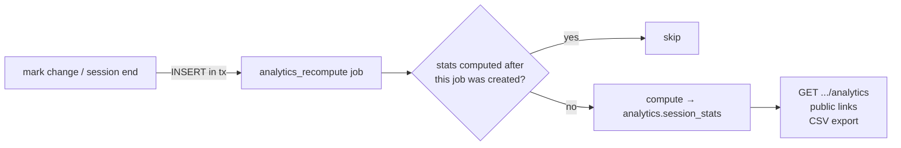

# Results & analytics

Code: `backend/internal/analytics`. Requirements: FR-RS-01…05, BA §11, BR-13, AC-12, ADR-15.

## Precomputation

Results pages are single-row reads (ADR-15). Every time `eval` recomputes an attempt total, its results hook inserts an `analytics_recompute` job in the same transaction; the session-end hook does the same.

The worker **debounces**: a burst of 100 marks queues 100 jobs, but every job created before the last computation is skipped after one cheap read. If no stats exist yet, reads compute them on demand.

## Metrics

**Class** (`ClassStats`), over finished attempts that are not invalidated:

| Metric | Definition |
|--------|------------|
| `joined` | all attempts in any state |
| `finished` | submitted plus invalidated |
| `marked` | finished and not invalidated (the base for the statistics below) |
| `mean_pct`, `median_pct` | of attempt percentages |
| `pass_rate` | share with `pct ≥ pass_mark_pct` |
| `completion_rate` | submitted ÷ joined |
| `invalidation_rate` | invalidated ÷ joined |
| `distribution` | 10 buckets of 10 percentage points |
| `pending` | attempts still waiting for LLM or manual marks |

**Question** (`QuestionRow`):

| Metric | Definition |
|--------|------------|
| `answered` | attempts that answered it |
| `pct_correct`, `avg_score` | over answered attempts |
| `option_counts` | SINGLE/MULTI picks per option |
| `common_wrong` | top 5 wrong answers (option text or normalised blank text) |
| `discrimination` | correct rate of the top 27% of students minus the bottom 27%; needs at least 4 marked attempts. Low or negative values mark questions that don't separate strong from weak students |

**Student** (`StudentRow`): score, percentage, passed, complete, time taken (start to submit), violations, extra time, pauses, and per-question answers.

**Quiz level** (`QuizStats`) rolls stored session stats up across sessions: students concatenated, question metrics weighted by answers, class figures recomputed, plus a per-session `comparison`.

Average time per *question* isn't reported because the timing model doesn't record per-question view times (D-32).

## Public links

`POST /api/teacher/share-links {scope, target_id, views, identify, show_answers, expires_at}`:

- The token is 128 random bits, base64url-encoded, **stored as SHA-256**, and returned only once (on create and regenerate).
- `views` is any of `individual`, `question_pct` and `pass_rate`. For a session it defaults to the session's `results_view` setting.
- In the individual view students appear as **"Student N"**, or as their classroom student number if `identify = student_id`. Names and emails never appear (BR-13). Individual answers appear only with `show_answers`. Invalidated attempts are left out.
- Links can be revoked (410 afterwards), regenerated (the old token gives 404), or expire. `GET /api/public/results/{token}` sends `X-Robots-Tag: noindex` and `Cache-Control: no-store`.
- The public page is the SPA route `/r/{token}`.

## Live leaderboard links

A share link with scope `live_session` or `live_poll` opens `/live/{token}`: the individual and team (or group) leaderboards, updating without login (V2-08, D-45). Views are `leaderboard` and `teams` (both by default).

- **Who is shown.** Sessions: classroom student IDs, or "Student N" in join order. Polls: nicknames (the default), or "Participant N". Real names and emails never appear, even in polls whose own leaderboard shows real names.
- **What is shown.** Sessions rank marked, valid attempts by percentage, with each student's team; teams come from the team standings (D-44). Polls rank by points, with groups when the poll has them. Polls that aren't scored show no board.
- **Updating.** `GET /api/public/live/{token}` is polled by the page every `refresh_ms` (3 s while running, 30 s once finished, 15 s while the tab is hidden). The server caches each link's view for 2 s, so a room full of viewers costs one computation per link. Responses carry `X-Robots-Tag: noindex` and `Cache-Control: no-store`.
- **Ending a link.** Turning a link off, an expiry, or deleting the poll or session makes it return `410`; a new link replaces the token. A live token opens only the live page, and a results token only `/r/`.

Teachers create live links on the poll's **Share** tab and on the session dashboard.

## CSV export

`GET /api/teacher/sessions/{id}/export.csv` writes one row per student with a column per question score. Cells starting with `=`, `+`, `-`, `@`, tab or CR are prefixed with `'` to prevent formula injection when opened in a spreadsheet (ADR-16).
