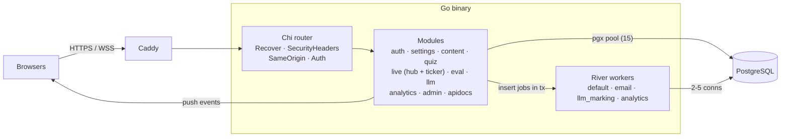
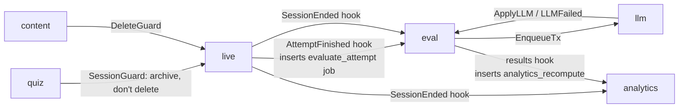

# Architecture

The backend is a **modular monolith** (ADR-01): one Go process holds the HTTP API, the WebSocket hub, the 1 Hz deadline ticker and the River job workers. It is sized for one 4 GB / Core i3 host serving about 100 concurrent students, with headroom to about 300.

## Components

## How a request flows

1. **Caddy** terminates TLS, serves the static SPA, and proxies `/api/*`, `/ws/*`, `/beacon/*` and `/healthz` to `127.0.0.1:8080`.
2. **Chi** runs the middleware stack in `internal/app/app.go`:
   - `httpx.Recover`: a panic becomes a 500 instead of killing the process.
   - `httpx.SecurityHeaders`: `nosniff`, `X-Frame-Options: DENY`, `Referrer-Policy`.
   - `httpx.SameOrigin` (on `/api`): state-changing requests need the `X-Requested-With` header and a matching `Origin`.
   - `auth.Middleware`: resolves the `__Host-sid` cookie to a user (cached for 30 s).
   - `auth.RequireRole(...)` per route group: `/api/admin` (admin), `/api/teacher` (teacher), student routes.
3. The **handler** (an `httpx.Handler` that returns `error`) decodes JSON with unknown fields rejected and calls a module **service**.
4. The service runs its SQL in a transaction. Side effects for other modules (marking, analytics, email) are **River jobs inserted in the same transaction**, so they run only if the change commits and are never lost (ADR-06).
5. Errors of type `*httpx.Error` render as `{code, message, fields}`. Anything else is logged and returned as a generic 500. Malformed UUIDs map to 404, and foreign-key conflicts map to 409.

## Module dependency rule

Modules talk to each other only through small Go interfaces declared by the **consumer**. Examples:

- `quiz.Topics` is implemented by `content`.
- `live.Quizzes` is implemented by `quiz`, and `live.Classrooms` by `content`.
- `eval.Attempts` is implemented by `live`, and `eval.LLMQueue` by `llm`.

Each module owns one PostgreSQL schema (`auth`, `settings`, `content`, `quiz`, `live`, `eval`, `llm`, `analytics`, `audit`). `internal/app` is the only package that knows every concrete type; it wires interfaces together and sets hooks:

Reads across schemas are limited to reporting code in `admin` (usage counts, own-data export) and to joins on stable identifiers. When a module needs another's data, add a method to that module and an interface on your side, rather than querying its tables.

## State: in memory vs Postgres

| State | Where | Why |
|-------|-------|-----|
| Sessions' frozen snapshot and settings | Postgres, cached in `live.Service.sessions` | Question delivery costs no DB reads; a restart reloads it lazily (ADR-05) |
| Attempt state, deadlines, answers, violations | Postgres only | Anything that affects grading is written **before** it is broadcast |
| WebSocket connections, "dashboard dirty" flags | `live.Hub` in memory | Ephemeral; rebuilt as clients reconnect |
| Session cookies | Postgres (`auth.sessions`, hashed) + 30 s in-memory cache | Instant revocation with one lookup per request at most |
| Rate-limit buckets | In memory | Per process; fine for one node |

Deadlines are timestamps and paused time is stored as remaining milliseconds, so killing the process mid-quiz loses nothing; `TestRestartRehydrates` verifies this.

## Background jobs

| Job (`Kind`) | Queue | Enqueued by | Does |
|--------------|-------|-------------|------|
| `email` | `email` (2 workers) | auth (register, reset) | Sends mail through SMTP or the log |
| `quiz_resource_check` | `default` | quiz (resource import/edit) | Checks image links with SSRF protection |
| `evaluate_attempt` | `default` | live (attempt submitted; invalidated at session end) | Key marking, predefined feedback, queues LLM work |
| `llm_mark` | `llm_marking` (4 workers) | eval / llm re-mark | Calls the teacher's provider; 120 s timeout, 4 attempts, unique by args |
| `analytics_recompute` | `analytics` (1 worker) | eval results hook, session end | Rebuilds stored session aggregates (debounced) |

## Memory budget

The architecture document's §2.1 budget drives several defaults:

- **Argon2id pool of 2 workers**: caps a login burst at about 38 MB instead of about 1.9 GB.
- **pgx pool of 15**, under `max_connections = 30`.
- **`GOMEMLIMIT=700MiB`** plus systemd **`MemoryMax=900M`**.
- **PostgreSQL** `shared_buffers = 512MB`, `work_mem = 8MB`, `autovacuum_work_mem = 64MB`.

## Scaling path

The architecture document stages growth so nothing needs rewriting:

1. Move to a bigger box and add PgBouncer in **session** mode (River needs LISTEN/NOTIFY).
2. Move Postgres to its own host.
3. Run several app nodes with sticky routing by session id, plus a cross-node event bus (Postgres LISTEN/NOTIFY) for the hub.

The module seams are where services would split, if ever needed.
