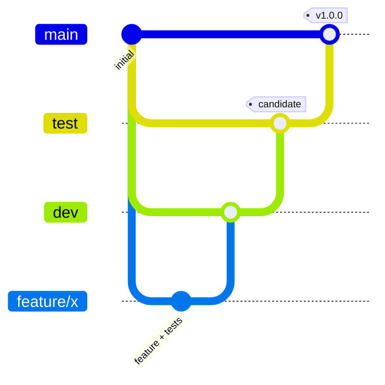

# Contributing

## Branches

- `feature/<name>`: one branch per feature, cut from `dev`.
- `dev`: integration. Merge features with `git merge --no-ff` once their tests pass.
- `test`: release candidates. Promote `dev` here when the full suite passes.
- `main`: released code only, tagged (`v1.0.0`, …). Releases are a product decision; ask first.

Commit messages: a summary line in the imperative, then a short body listing what changed and which requirement it serves.

## Ground rules

1. **The BA document decides.** If the requirements leave a choice open, pick the option most consistent with them and record it in `DECISIONS.md` (next `D-nn`, the decision, and its BA/ADR basis). That file is rendered as the [Decision log](decisions.md).
2. **Tests with every change**, at the layers listed in [Testing](testing.md).
3. **Respect module boundaries.** Use interfaces owned by the consumer, keep tables inside the module's schema, and put cross-module effects in in-transaction River jobs or hooks wired in `app.go`.
4. **Write-through.** Anything that affects grading is in Postgres before it is broadcast.
5. **The server owns time.** Never trust client timestamps for decisions; they are evidence only.
6. **Never expose answer keys or API keys.** Add assertions when you touch a payload students see.
7. **Keep the student bundle small.** Heavy libraries must stay out of `/attempt` and `/j` (check `npm run build`).

## Recipes

### Add an HTTP endpoint

1. Add the service method, with tests, in the owning module.
2. Add the handler in the module's `http.go`, mounted in the right `…Routes` function. It returns `error`; decode with `httpx.Decode`; get the user with `auth.MustUser`.
3. Document it in `backend/internal/apidocs/openapi.yaml` (tag, operationId, request and response schema). `TestOpenAPIMatchesRoutes` fails until you do.
4. Add a client call in the frontend (`api.get/post/...`) and its type in `lib/types.ts`.

### Add a setting

Follow [Configuration hierarchy → Adding a setting](settings.md#adding-a-setting).

### Add a question type

1. `quiz/question.go`: add the type constant, `Body`/`Key` fields if needed, and rules in `Validate`, `Normalise`, `DefaultPartialCredit`, `LLMAllowed`/`KeyAllowed`.
2. `quiz/csv.go`: the parsing rules and a `Template` example row.
3. `quiz/response.go`: validate the new response shape.
4. `eval/marker.go`: fraction rules in `fraction`, and wrong-answer grouping in `analytics/compute.go`.
5. `live/timing.go`: whether its choices need shuffling in `newOrders`.
6. Frontend: render in `QuestionView.svelte`, author in `QuestionEditor.svelte`, describe in `answerText.ts`, and add the label in `types.ts`.
7. Update `QuestionType` in `openapi.yaml`, plus [Marking](marking.md) and the glossary.

### Add a background job

Define `Args` with `Kind()` and `InsertOpts()` (choose a queue in `platform/jobs`, and set `MaxAttempts`, uniqueness and `Timeout` deliberately). Write a `Worker` with `river.WorkerDefaults`. Register it in `app.Build`, insert it with `jobs.Inserter.InsertTx` inside the triggering transaction, and test the worker logic directly.

### Add a migration

Add `backend/migrations/NNNN_name.sql` with the next number. Keep it in the module's schema. Never edit one that has shipped. Tests migrate a template database automatically.

### Update these docs

The pages are Markdown files in `frontend/src/lib/docs/pages/`. Add a page by creating the file and listing it in `NAV` (`lib/docs/index.ts`); a test fails if a page isn't in the navigation or a `page.md` link points nowhere. Diagrams use fenced `mermaid` blocks. Links to other pages are written as `other-page.md#anchor`.
