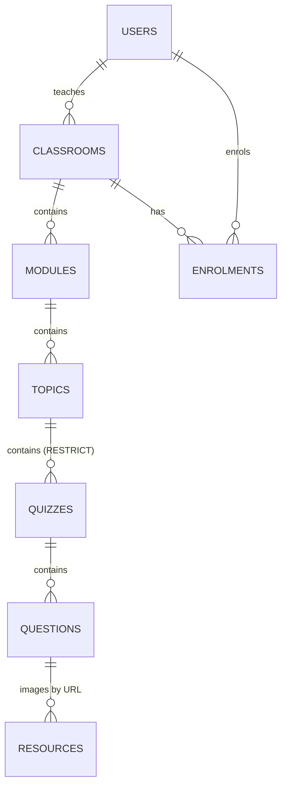
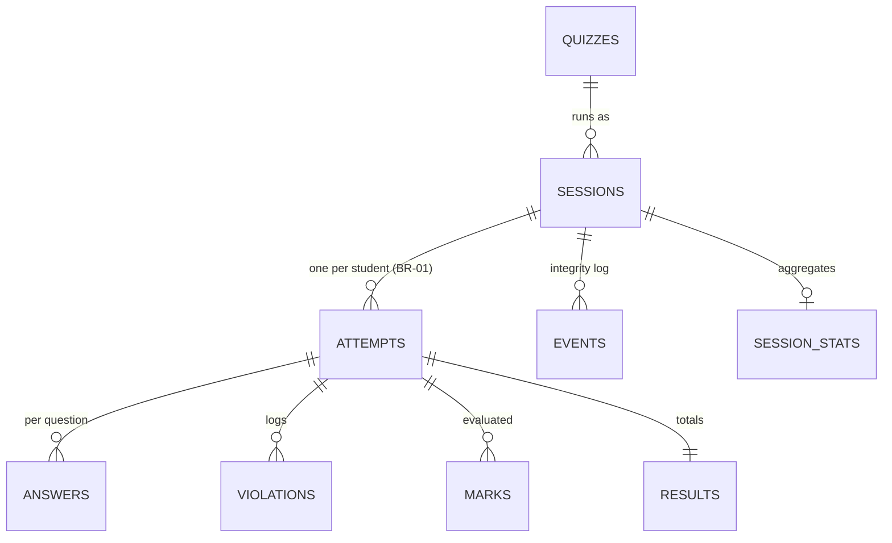

# Data model

Migrations live in `backend/migrations/NNNN_*.sql` and are embedded into the binary; `db.Migrate` runs pending ones on startup. **Never edit a migration that has shipped.** Add a new numbered file instead.

| Migration | Creates |
|-----------|---------|
| `0001_init.sql` | `audit` schema, `pgcrypto` |
| `0002_auth.sql` | `auth.users`, `auth.sessions`, `auth.tokens`, `auth.policy` |
| `0003_settings_content.sql` | `settings.platform`, `settings.teacher`, `content.*` |
| `0004_quiz.sql` | `quiz.quizzes`, `quiz.questions`, `quiz.resources` |
| `0005_live.sql` | `live.sessions`, `live.attempts`, `live.answers`, `live.violations`, `live.events` |
| `0006_eval.sql` | `eval.marks`, `eval.results` |
| `0007_llm.sql` | `llm.keys` |
| `0008_analytics.sql` | `analytics.session_stats`, `analytics.share_links` |
| `0009_poll.sql` | `poll.polls`, `poll.questions`, `poll.participants`, `poll.responses`, `poll.hidden_words`, `poll.files` |
| `0010_categories.sql` | `content.categories`, `content.enrolment_categories` |
| `0015_poll_board.sql` | Whiteboard: `poll.board_strokes`, board access columns on `poll.polls` |
| `0014_live_links.sql` | Share links gain the `live_session` and `live_poll` scopes and `nickname` identification |
| `0013_session_teams.sql` | Session teams: `live.teams`, `team_id`/`captain` on `live.attempts` |
| `0012_poll_groups.sql` | Poll groups: `poll.groups`, `group_id`/`captain` on participants, group settings on `poll.polls`, `created_at` on responses |
| `0011_poll_scoring.sql` | Scored polls: competition settings on `poll.polls`, `key`/`points`/`time_limit_sec` on questions, `nickname` on participants, `score`/`correct`/`elapsed_ms` on responses |

River's own tables (`river_job`, ...) are created by `jobs.Migrate`.

## Content hierarchy

- Classrooms, modules, topics and questions carry a `settings jsonb` column with sparse overrides; quizzes do too.
- `quiz.questions` stores `body`, `answer_key` and `feedback` as JSONB, plus `marks`, `negative_marks`, `partial_credit` and `settings`. `UNIQUE (quiz_id, code)`. `body.format` is `markdown` for text written in the rich text editor and absent for plain text (CSV import, older questions); it applies to the question text and the predefined feedback.
- `quiz.resources` is `UNIQUE (question_id, role, n)`, with `status` one of `unchecked`, `ok`, `broken`.
- `content.enrolments` is `UNIQUE (classroom_id, user_id)`, with a partial unique index on `(classroom_id, lower(student_number))` for current members (FR-CLS-06).
- `quiz.quizzes.topic_id` is `ON DELETE RESTRICT`: a topic with quizzes cannot be deleted (the API returns 409).

## Live runs

### `live.sessions`

`snapshot jsonb` freezes the quiz at creation: its title, the base effective settings (defaults → platform → teacher), the classroom/module/topic/quiz override layers, and every question including keys. `settings` holds session-level overrides (editable while live). `extension_sec` is the session-wide extension. `released_at` is set by a manual release.

### `live.attempts`

One row per `(session_id, user_id)`.

| Column(s) | Meaning |
|-----------|---------|
| `state` | `waiting`, `admitted`, `in_progress`, `paused`, `submitted`, `invalidated`, `not_started` |
| `countdown_deadline`, `quiz_deadline`, `question_deadline` | Server timestamps |
| `quiz_remaining_ms`, `question_remaining_ms` | Set instead of deadlines while paused |
| `current_index`, `question_order int[]`, `option_orders jsonb` | Position and this student's shuffles |
| `overrides`, `extension_sec` | Student-level settings and extra time |
| `warnings`, `violations`, `disconnected_at`, `invalid_reason` | Proctoring state |

The partial index `attempts_due_idx` covers `admitted` and `in_progress` rows for the ticker.

### `live.answers`

Primary key `(attempt_id, question_id)`. `question_id` refers to the **snapshot**, not `quiz.questions`, so editing or deleting a question never orphans answers. `client_seq` makes saves idempotent: an older sequence never overwrites a newer one. `student_number` is copied onto every answer (BR-03).

## Evaluation and LLM

- **`eval.marks`**, primary key `(attempt_id, question_id)`:
  - `method`: `key`, `llm` or `manual`.
  - `status`: `marked`, `pending`, `needs_manual` or `overridden`.
  - Scores: `score`, `max_score`, `fraction`, `correct`.
  - Feedback: `feedback` (predefined), `ai_feedback`, `ai_rationale`, `ai_marked`.
  - Review: `flagged`, `flag_reason`, `overridden_by`.
- **`eval.results`**: attempt totals: `score`, `max_score`, `pct`, `pass_mark_pct`, `passed`, `complete` (no pending or manual marks left) and `invalidated`.
- **`llm.keys`**: `ciphertext`, `nonce`, `wrapped_dek`, `dek_nonce`, `kek_id`, `last4`, `key_version`, `is_default` (at most one per teacher), and the last test result. **There is no plaintext column.**

## Analytics and audit

- `analytics.session_stats`: one JSON document per session (`SessionStats`) and `computed_at`.
- `analytics.share_links`: `token_hash` (SHA-256 of a 128-bit token), `scope` (`session` or `quiz`), `views text[]`, `identify`, `show_answers`, `expires_at`, `revoked_at`.
- `audit.events`: actor, action, target and details JSON. Written inside the transaction of the action (mark overrides, reinstatements, status changes, key changes, releases, share links).
- `live.events`: the per-session integrity timeline shown to teachers (`joined`, `admitted`, `started`, `paused`, `resumed`, `extended`, `violation`, `reinstated`, `question_timed_out`, `submitted`, `session_ended`, `results_released`, ...).

## Student categories

`content.categories` holds a classroom's labels (name unique per classroom, case-insensitive; `color` is a slot 1–8 of the categorical palette). `content.enrolment_categories` links enrolments to categories, so a student can be in several and removing a student from the classroom keeps the history. Both cascade from the classroom. See D-41.

## Polls

`poll.polls` holds the settings (`identity`, `audience`, `pacing`, `show_results`, `allow_edit`), the status and, for presenter pacing, `current_index` and `revealed`. A check constraint makes classroom-only polls identified. `poll.participants` has **either** a `user_id` (identified) **or** a `token_hash` (anonymous), never both, unique per poll. `poll.responses` has one JSON value per participant and question, with `hidden` for moderation; `poll.hidden_words` hides words from word clouds. `poll.files` stores uploads as `bytea` (12 MB cap per row). Everything cascades from the poll. See [Live polls](polls.md).

Scored polls (D-42) add `scoring`, `speed_bonus`, `leaderboard`, `show_answers`, `names`, `answers_revealed` and `question_started_at` to `poll.polls`; an answer `key` (JSON, never sent to participants before it is revealed), `points` and `time_limit_sec` to `poll.questions`; `nickname` to `poll.participants`; and to `poll.responses` the stored `score`, `correct` and `elapsed_ms` (time from the question appearing, for the speed bonus). Scores are stored when an answer is saved and recomputed when a key, points or the scoring settings change.

Groups (D-43): `poll.groups` (name unique per poll, case-insensitive; `color` 1–8; `category_id` when formed from a classroom category; at most 50 per poll). `poll.participants.group_id` (set to NULL when the group is deleted) and `captain`, with a partial unique index so a group has at most one captain. `poll.polls` gains `groups`, `group_acceptance` and `group_calc`; `poll.responses.created_at` records when an answer was first given, for "the group's first answer". Group scores aren't stored: they are combined from member scores when the leaderboard is computed, so changing the acceptance or calculation applies at once.

The whiteboard (D-47) stores each mark in `poll.board_strokes`: tool, colour, size, `points` (x,y pairs on a 1600×900 board), optional text, a `gesture` id that joins the pieces of one pen line, and the participant who drew it (NULL for the teacher; cascades when the participant or poll goes). `poll.polls` gains `board_open`, `board_mode` and the `board_groups`/`board_participants` allowed to draw in `selected` mode. At most 20,000 strokes per board.

## Deletion and anonymisation

- **User delete** (admin or self) rewrites the user's email to `deleted+<id>@invalid`, name to "Deleted user" and password to `!`, and removes their sessions and tokens. Attempts, answers and results stay for the teacher (D-04).
- **Quiz delete** archives the quiz instead if any session ran it (BR-16).
- **Classroom delete** is refused if any session ran in it (D-11).
