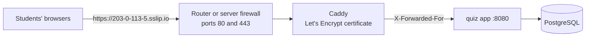

# Deploying without a domain

You don't need to buy a domain to run the platform for a class. This page covers four setups: a server with its own public IP, a PC behind a home or school router, a connection where port forwarding is impossible, and a single classroom Wi-Fi. All of them use the Docker Compose files in the repository (D-37, D-50).

## Why a bare IP address isn't enough

Opening `http://203.0.113.5` looks simpler, but logins fail there, for two reasons:

- **The session cookie needs HTTPS.** It is a `__Host-` cookie, which is always Secure (ADR-13). Browsers make an exception only for `localhost` and `127.0.0.1`, so the exception covers only the computer running the app.
- **Public certificates are issued for names, not addresses.** Without a name there's no trusted HTTPS.

The fix in each setup below is a free hostname that already points to your IP. [sslip.io](https://sslip.io) turns any IP into a name: `203-0-113-5.sslip.io` resolves to `203.0.113.5`. Caddy can then get a real Let's Encrypt certificate for it automatically.

The app also accepts logins and other changes only from the exact address in `QP_BASE_URL`, so everyone, including you, must open that address. Opening another address for the same server gives "cross-site request rejected".

## Choose a setup

| Where the app runs | Use | Students open |
|---|---|---|
| A VPS or cloud server with a public IP | [Server with a public IP](#server-with-a-public-ip) | `https://203-0-113-5.sslip.io` |
| Your PC, at home or school, behind a router you control | [PC behind a router](#pc-behind-a-router) | `https://203-0-113-5.sslip.io` |
| Your PC, but the provider shares your IP (CGNAT) or you can't change the router | [Cloudflare quick tunnel](#cloudflare-quick-tunnel) | `https://random-words.trycloudflare.com` |
| Your PC, with students on the same Wi-Fi only | [Classroom network only](#classroom-network-only) | `https://192.168.1.50` (after accepting a warning) |



In every setup, replace `203.0.113.5` with your real public IP. In sslip.io names, write it with dashes: `203-0-113-5`.

## Server with a public IP

Use this for a VPS (Contabo, Hetzner, DigitalOcean and similar), where the IP is fixed and ports are open.

1. Install Docker with the Compose plugin, and open SSH, 80 and 443 in the firewall:
   ```bash
   sudo ufw allow OpenSSH && sudo ufw allow 80 && sudo ufw allow 443/tcp && sudo ufw allow 443/udp && sudo ufw enable
   ```
2. Copy the repository to the server, then `cp home.env.example .env`.
3. In `.env`, set `POSTGRES_PASSWORD`, then set both addresses:
   ```
   QP_DOMAIN=203-0-113-5.sslip.io
   QP_BASE_URL=https://203-0-113-5.sslip.io
   ```
4. Start the app with Caddy:
   ```bash
   docker compose --profile tls up -d --build
   docker compose logs caddy   # look for "certificate obtained successfully"
   ```
5. Create the first admin (the password is read from standard input):
   ```bash
   echo 'a-strong-password' | docker compose exec -T app /app/server create-admin you@school.edu "Your Name"
   ```
6. Log in at `https://203-0-113-5.sslip.io/login`. The admin console is at `/admin`.

A server's IP doesn't change, so the link keeps working. If you buy a domain later, change `QP_DOMAIN` and `QP_BASE_URL` to it and restart. Accounts and data stay.

### Several apps on one server

Only one program can listen on port 443, so the apps share one Caddy installed directly on the server, and each gets its own name. sslip.io accepts any prefix, so the names are free too: `quiz.203-0-113-5.sslip.io` and `app2.203-0-113-5.sslip.io` both point to the same IP.

1. Install Caddy on the host (`sudo apt install -y caddy`). Start this app **without** the `tls` profile (`docker compose up -d --build`). Set `QP_HTTP_BIND=127.0.0.1:8080`, and give every other app its own local port: 8081, 8082, and so on.
2. In `/etc/caddy/Caddyfile`, add one block per app:
   ```caddy
   quiz.203-0-113-5.sslip.io {
   	encode zstd gzip
   	header {
   		X-Content-Type-Options nosniff
   		Referrer-Policy same-origin
   		Content-Security-Policy "default-src 'self'; script-src 'self' 'unsafe-inline'; style-src 'self' 'unsafe-inline'; img-src 'self' https: data:; connect-src 'self' wss:; object-src 'none'; frame-ancestors 'none'; base-uri 'self'; form-action 'self'"
   		-Server
   	}
   	reverse_proxy 127.0.0.1:8080
   }

   app2.203-0-113-5.sslip.io {
   	reverse_proxy 127.0.0.1:8081
   }
   ```
3. Set `QP_BASE_URL=https://quiz.203-0-113-5.sslip.io` in this app's `.env`. Then run `docker compose up -d` and `sudo systemctl reload caddy`.

Caddy on the host reaches the app over loopback, which the app already trusts, so students' real addresses still reach the rate limits (D-51). Give each app its own name; serving one under a path such as `/quiz` isn't supported.

## PC behind a router

Use this when the app runs on your own computer, and students connect from home or another network.

1. **Check that you have a real public IP.** Compare the WAN IP on the router's status page with what [ifconfig.me](https://ifconfig.me) shows. If they differ, or the WAN IP starts with `10.`, `192.168.`, `172.16`–`172.31` or `100.64`–`100.127`, the provider shares one IP across many customers (CGNAT). Port forwarding can't work then; use the [Cloudflare quick tunnel](#cloudflare-quick-tunnel) instead.
2. **Give the PC a fixed local IP** with a DHCP reservation in the router, for example `192.168.1.50`.
3. **Forward ports** in the router to that IP: TCP 80, TCP 443 and, optionally, UDP 443. Port 80 is needed for Let's Encrypt to check that you control the name.
4. **Allow ports 80 and 443 in the Windows firewall.** Docker Desktop usually asks the first time.
5. **Follow steps 2 to 6 of [Server with a public IP](#server-with-a-public-ip).** `home.env.example` already lists every setting with comments.
6. **Test from a phone on mobile data, not your Wi-Fi.** Some routers can't reach their own public IP from inside the network, so the address can fail at home and still work for everyone outside.

Things to plan for:

- **The public IP can change**, for example after a router restart. Update both lines in `.env`, run `docker compose --profile tls up -d` and share the new link. A free dynamic DNS name, such as DuckDNS, follows the IP by itself; use it as `QP_DOMAIN` instead of the sslip.io name.
- **The PC must stay on** with Docker running for the whole class. Upload speed limits how many students can connect. Voting and quizzes are light, so a normal home connection is fine for a class.
- **Turn the port forwards off** when you're not hosting.

## Cloudflare quick tunnel

Use this when port forwarding is impossible: behind CGNAT, on a school network you don't manage, or with no access to the router. The tunnel connects out to Cloudflare, which gives you an HTTPS address. There are no router changes and no Caddy.

1. Install `cloudflared` from Cloudflare's downloads page.
2. Start the app without the `tls` profile: `docker compose up -d --build`.
3. Run the tunnel and copy the `https://….trycloudflare.com` address it prints:
   ```bash
   cloudflared tunnel --url http://localhost:8080
   ```
4. Set `QP_BASE_URL` to that address in `.env`, then run `docker compose up -d` again.
5. Share the address with students and log in there yourself.

The address changes every time the tunnel starts, so use this for one class at a time. Through the tunnel, every student reaches the app from the same local address, so all joins count against the same network limit (see [Limits to know](#limits-to-know)). A named Cloudflare tunnel keeps a fixed address, but it needs a domain on Cloudflare.

## Classroom network only

Use this when every student is on the same Wi-Fi as your PC and nobody connects from outside.

1. Give the PC a fixed local IP, for example `192.168.1.50`.
2. In `.env`, set:
   ```
   QP_DOMAIN=192.168.1.50
   QP_BASE_URL=https://192.168.1.50
   ```
3. Run `docker compose --profile tls up -d --build`.

Let's Encrypt can't check a private address, so for an IP address Caddy issues the certificate from its own local authority. Each device shows a security warning once; students accept it to continue. To avoid the warning, install Caddy's root certificate on the devices (`docker compose cp caddy:/data/caddy/pki/authorities/local/root.crt .`), which is practical only for school-managed devices. If the warning is a problem, the [Cloudflare quick tunnel](#cloudflare-quick-tunnel) gives a trusted certificate with the same effort.

## Checking it works

| Symptom | Cause and fix |
|---|---|
| "cross-site request rejected" when logging in | The address in the browser isn't exactly `QP_BASE_URL`. Open that address, or change `QP_BASE_URL` and restart. |
| Logged in, then logged out straight away | The page isn't on HTTPS, so the browser drops the session cookie. Use one of the HTTPS setups above. |
| `docker compose logs caddy` shows certificate errors | Port 80 or 443 doesn't reach this machine: check the port forwards, the firewall and CGNAT. Let's Encrypt allows only a few failed attempts per hour, so fix the cause before retrying. |
| Works on mobile data, but not on your Wi-Fi | The router can't reach its own public IP from inside. Test from outside, or use the PC's local address while at home. |
| Worked yesterday, not today | The public IP changed. Update `.env`, restart and share the new link, or switch to a dynamic DNS name. |
| Ports 80 or 443 already in use | Another web server or app holds them. Stop it, or put both apps behind one Caddy (see [Several apps on one server](#several-apps-on-one-server)). |

## Limits to know

- **Joining from one network:** students on one school network share a public address. Up to 150 can join a poll at once from one address, then four more a second (D-51), so a lecture hall can join together.
- **Docker Desktop on Windows and macOS** can replace students' addresses with an internal one before Caddy sees them. Rate limits then count everyone as one network. The join limit above still fits a class. A Linux server doesn't have this problem.
- **Back up** the `pgdata` and `appdata` volumes (`appdata` holds the master key) somewhere other than the PC or server. See [Deployment](/docs/deployment).
