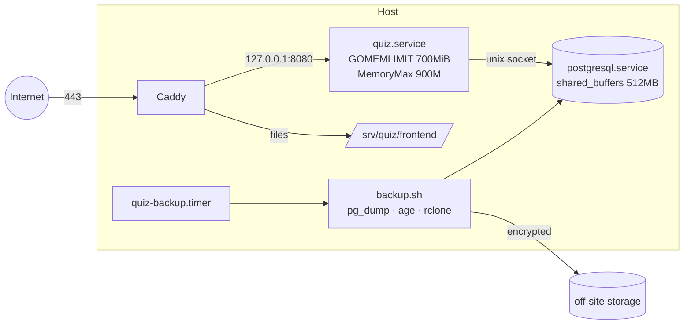
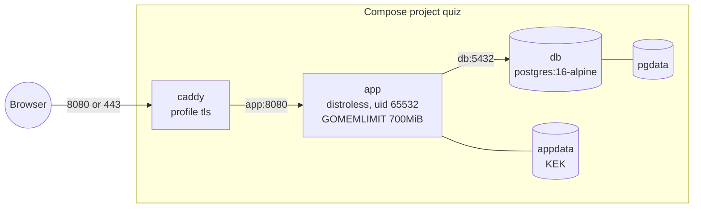

# Deployment

Target: one Ubuntu host with 4 GB RAM and a Core i3, running PostgreSQL, the Go binary and Caddy (architecture §1.4). Files: `deploy/`.



## Steps

1. **PostgreSQL 16/17.**
   - Copy `deploy/postgresql.conf.d/quiz.conf` into `/etc/postgresql/<v>/main/conf.d/`.
   - Create a `quiz` role and database, then restart.
   - The config listens on localhost only, sets `max_connections = 30`, `statement_timeout = 15s` and `idle_in_transaction_session_timeout = 30s`, and enables `pg_stat_statements`.
2. **Build.**

   ```sh
   cd backend && GOOS=linux GOARCH=amd64 go build -o server ./cmd/server
   cd frontend && npm ci && npm run build
   ```

   Copy `server` to `/srv/quiz/server` and `frontend/build/` to `/srv/quiz/frontend/`.
3. **Master key.**
   - Run `openssl rand 32 > /etc/quiz/kek.key`, owned by root with mode 0400.
   - Store a copy **offline**.
4. **Service.**
   - Install `deploy/quiz.service`.
   - Set `QP_BASE_URL` and `QP_DATABASE_URL`.
   - Run `systemctl enable --now quiz`.
   - The unit loads the KEK through `LoadCredential`, restarts on failure, and runs hardened: no new privileges, read-only system, private /tmp.
5. **Caddy.**
   - Put your domain in `deploy/Caddyfile`, install it, and reload Caddy.
   - Caddy obtains TLS certificates automatically. It proxies `/api`, `/ws`, `/beacon` and `/healthz` to Go and serves the SPA with precompressed files.
6. **Admin.** Run `echo '…' | sudo -u quiz /srv/quiz/server create-admin you@school.edu "Your Name"`; it needs the same environment as the service.
7. **Email.** Set `QP_SMTP_*`, and put the SMTP password in a file loaded through `LoadCredential`.
8. **Backups.**
   - Install `age` and `rclone`, configure an `offsite` remote, and put the age public key in `/etc/quiz/backup.pub`.
   - Enable `quiz-backup.timer`.
   - It keeps 14 daily and 8 weekly encrypted dumps. **Test a restore monthly.**
9. **Load test** before real classes. Follow the header of `loadtest/classroom.js`: ramp to 300 sockets in 60 s, with thresholds p95 save < 150 ms, admit → countdown < 500 ms, and login p95 < 3 s.

## Containers

The alternative to the host install is `Dockerfile` with `compose.yaml` at the repository root. Both work with Docker and Podman.



- **Image.** A multi-stage build: Node builds the SPA, Go builds a static binary, and the runtime is `gcr.io/distroless/static-debian12:nonroot` (no shell). The binary serves the SPA (`QP_STATIC_DIR=/app/web`) and implements its own probe, `server healthcheck`, which the `HEALTHCHECK` uses.
- **Start-up order.** Compose waits for `pg_isready`. The app also retries the database for `QP_DB_WAIT_SECONDS`, because some `podman-compose` versions ignore health conditions.
- **Master key.** Bind-mounting a 0400 key file into a non-root container breaks on ownership. Instead, `QP_KEK_GENERATE=1` creates the key inside the `appdata` volume on first start and never overwrites it. The key is still never read from an environment variable (ADR-09). Back up `appdata` together with `pgdata`.
- **HTTPS.** `__Host-` cookies need a secure context. `http://localhost` qualifies, a LAN address does not. The `tls` profile adds Caddy (`deploy/container/Caddyfile`) with automatic certificates for `QP_DOMAIN`, using the internal CA for `localhost` or an IP address.
- **Database.** It has no published port. Tuning comes from `deploy/postgresql.conf.d/quiz.conf` and is passed as `-c` flags.
- **Admin.** Run `echo 'pw' | docker compose exec -T app /app/server create-admin <email> <name>`.
- **Backups.** Run `docker compose exec db pg_dump -U quiz -Fc quiz > quiz.dump`, or point `deploy/backup.sh` at the container.

## Upgrades

Copy the new binary and `systemctl restart quiz`. Migrations run on start; each runs in its own transaction and is recorded. Deadlines are timestamps and sockets reconnect, so restarting during a quiz is safe (`TestRestartRehydrates`), though it is still better done between classes. Frontend assets are content-hashed, so replacing `build/` is atomic enough; clients load the new `index.html` on their next navigation.

## Monitoring

- **Health:** `GET /healthz` returns `{"status":"ok"}`, or 503 when the database is unreachable.
- **Logs:** JSON on stdout (`journalctl -u quiz`), including River queue statistics.
- **Database:** `pg_stat_activity` and `pg_stat_statements`.
- **Host:** `free` and `vmstat`. Watch for swap-in; the architecture's pass criteria are a Go heap under 400 MB and fewer than 25 Postgres connections.
- **Admin console:** usage counts and job-queue states.

## Configuration reference

See [Getting started](getting-started.md#configuration). For a deployment that shouldn't expose the API description, set `QP_API_DOCS=0`.
