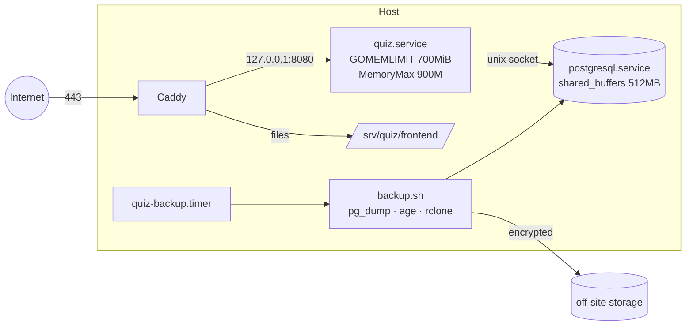
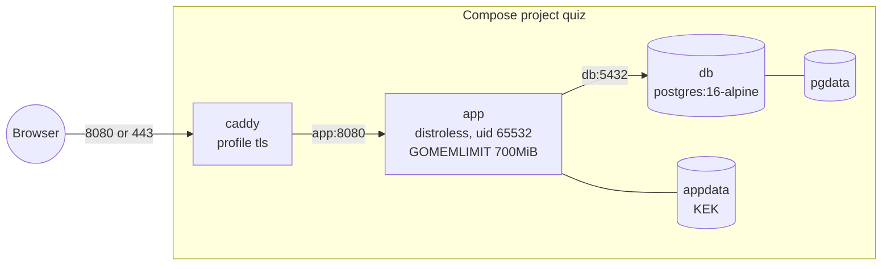

# Deployment

Target: one Ubuntu host with 4 GB RAM and a Core i3, running PostgreSQL, the Go binary and Caddy (architecture §1.4). Files: `deploy/`.



## Steps

1. **PostgreSQL 16/17.**
   - Copy `deploy/postgresql.conf.d/quiz.conf` into `/etc/postgresql/<v>/main/conf.d/`.
   - Create a `quiz` role and database, then restart.
   - The config listens on localhost only, sets `max_connections = 30`, `statement_timeout = 15s` and `idle_in_transaction_session_timeout = 30s`, and enables `pg_stat_statements`.
2. **Build.**

   ```sh
   cd backend && GOOS=linux GOARCH=amd64 go build -o server ./cmd/server
   cd frontend && npm ci && npm run build
   ```

   Copy `server` to `/srv/quiz/server` and `frontend/build/` to `/srv/quiz/frontend/`.
3. **Master key.**
   - Run `openssl rand 32 > /etc/quiz/kek.key`, owned by root with mode 0400.
   - Store a copy **offline**.
4. **Service.**
   - Install `deploy/quiz.service`.
   - Set `QP_BASE_URL` and `QP_DATABASE_URL`.
   - Run `systemctl enable --now quiz`.
   - The unit loads the KEK through `LoadCredential`, restarts on failure, and runs hardened: no new privileges, read-only system, private /tmp.
5. **Caddy.**
   - Put your domain in `deploy/Caddyfile`, install it, and reload Caddy.
   - Caddy obtains TLS certificates automatically. It proxies `/api`, `/ws`, `/beacon` and `/healthz` to Go and serves the SPA with precompressed files.
6. **Admin.** Run `echo '…' | sudo -u quiz /srv/quiz/server create-admin you@school.edu "Your Name"`; it needs the same environment as the service.
7. **Email.** Set `QP_SMTP_*`, and put the SMTP password in a file loaded through `LoadCredential`.
8. **Backups.**
   - Install `age` and `rclone`, configure an `offsite` remote, and put the age public key in `/etc/quiz/backup.pub`.
   - Enable `quiz-backup.timer`.
   - It keeps 14 daily and 8 weekly encrypted dumps. **Test a restore monthly.**
   - Set `QP_NIGHTLY_BACKUP_DIR=/var/backups/quiz` for the server (it is in `quiz.service`), and the admin console shows the nightly backups and warns when the job hasn't succeeded for 2 days. The script makes its files readable by the `quiz` group for that.
   - Admins can also export a backup from the console (Admin → Backups, D-57); it is written to `QP_BACKUP_DIR` (default `data/backups`) and encrypted with a passphrase chosen there.
9. **Load test** before real classes. Follow the header of `loadtest/classroom.js`: ramp to 300 sockets in 60 s, with thresholds p95 save < 150 ms, admit → countdown < 500 ms, and login p95 < 3 s. If classes use the whiteboard, also run `loadtest/whiteboard.js` (`VIEWERS`, `DRAWERS`, `DURATION`; see its header) with the class size you expect.

## Containers

The alternative to the host install is `Dockerfile` with `compose.yaml` at the repository root. Both work with Docker and Podman.



- **Image.** A multi-stage build: Node builds the SPA, Go builds a static binary, and the runtime is `gcr.io/distroless/static-debian12:nonroot` (no shell). The binary serves the SPA (`QP_STATIC_DIR=/app/web`) and implements its own probe, `server healthcheck`, which the `HEALTHCHECK` uses.
- **Start-up order.** Compose waits for `pg_isready`. The app also retries the database for `QP_DB_WAIT_SECONDS`, because some `podman-compose` versions ignore health conditions.
- **Master key.** Bind-mounting a 0400 key file into a non-root container breaks on ownership. Instead, `QP_KEK_GENERATE=1` creates the key inside the `appdata` volume on first start and never overwrites it. The key is still never read from an environment variable (ADR-09). Back up `appdata` together with `pgdata`.
- **HTTPS.** `__Host-` cookies need a secure context. `http://localhost` qualifies, a LAN address does not. The `tls` profile adds Caddy (`deploy/container/Caddyfile`) with automatic certificates for `QP_DOMAIN`, using the internal CA for `localhost` or an IP address.
- **Hosting from a home or school PC.** No domain is needed: `home.env.example` uses a free sslip.io name for the router's public IP, so Caddy gets a Let's Encrypt certificate once ports 80 and 443 are forwarded (D-50). See [Deploying without a domain](/docs/deploy-without-domain) for this and the other setups without a domain.
- **Client addresses.** Caddy has a fixed address on the compose network (`QP_CADDY_IP`, default `172.31.250.10`), and the app trusts `X-Forwarded-For` only from it (`QP_TRUSTED_PROXIES`), so rate limits count each student's network rather than Caddy (D-51).
- **Database.** It has no published port. Tuning comes from `deploy/postgresql.conf.d/quiz.conf` and is passed as `-c` flags.
- **Admin.** Run `echo 'pw' | docker compose exec -T app /app/server create-admin <email> <name>`.
- **Backups.** Export them from the admin console (Admin → Backups): they go to `/var/lib/quiz/backups` in the `appdata` volume, so download a copy off the host. `docker compose exec db pg_dump -U quiz -Fc quiz > quiz.dump` still works too.

## Tutoring

Tutoring (D-59) is a second service with LiveKit as its media server, on its own subdomain. Leave it out and the platform shows no tutoring features.

- **Host install.**
  1. Create the shared secret: `openssl rand -hex 32 > /etc/quiz/tutoring.secret`, mode 0400. Give it to both services with `LoadCredential` and set `QP_TUTORING_URL=https://tutor.example.edu` and `QP_TUTORING_SECRET_FILE` for the platform.
  2. Create LiveKit's key file: `printf 'tutoring: %s\n' "$(openssl rand -hex 24)" > /etc/livekit/keys.yaml`, mode 0400. Run LiveKit 1.13.7 with `deploy/livekit.yaml`.
  3. Build `tutoring/` (`go build -o /srv/quiz-tutoring/tutor ./cmd/tutor`), create a `quiz-tutoring` user and database role, and install `deploy/quiz-tutoring.service`.
  4. Add the `tutor.example.edu` block of `deploy/Caddyfile`, and its address to the platform's `connect-src`.
  5. Open UDP 7882 and TCP 7881 in the firewall for media. Keep 7880 and 8090 closed: Caddy reaches them on loopback.
- **Containers.** Set `QP_TUTORING_URL`, `QP_TUTORING_MEDIA_URL` (`wss://…`) and `QP_TUTOR_DOMAIN` in `.env`, then `docker compose --profile tls --profile tutoring up -d --build`. The app creates the shared secret in the `tutorsecrets` volume on first start and the tutoring service creates LiveKit's key file there; LiveKit starts once both exist. Caddy forwards `/rtc` to LiveKit and the rest to the tutoring service.
- **Limits.** Tutoring and LiveKit have their own memory and CPU limits (TS-NFR-54); the bandwidth budget comes in a later phase.
- **Capacity.** `node loadtest/tutoring-media.mjs` checks what LiveKit carries on the machine it runs on (D-58).

## Restoring a backup

A backup from the admin console restores with the server binary itself; no `pg_dump` or `pg_restore` is needed (D-57).

1. Check the file and the passphrase (no database needed): `server check-backup qp-….qpbackup.age < passphrase.txt`. It reads the whole backup and checks every table's row count.
2. Create a new, empty database, for example `createdb -O quiz quiz_restored`. Restore refuses a database that already has tables.
3. Restore, with the master key the backup was made with in place:

   ```sh
   QP_DATABASE_URL=postgres://quiz@/quiz_restored?host=/var/run/postgresql \
   QP_KEK_FILE=/etc/quiz/kek.key \
   /srv/quiz/server restore-backup qp-….qpbackup.age < passphrase.txt
   ```

   It builds the schema the backup was made with, loads every table in one transaction, checks the row counts and the references between tables, and sets the sequences. It warns if `QP_KEK_FILE` isn't the key the backup was made with: everything else restores, but teachers would have to enter their AI keys again.
4. Point the service at the restored database and start it; newer migrations apply as usual.

In containers, run the same command with `docker compose run --rm -T -e QP_DATABASE_URL=… app /app/server restore-backup /var/lib/quiz/backups/qp-….qpbackup.age < passphrase.txt`. The nightly job's `.dump.age` files restore with `age -d -i backup.key file | pg_restore -d …`, as before.

## Upgrades

Copy the new binary and `systemctl restart quiz`. Migrations run on start; each runs in its own transaction and is recorded. Deadlines are timestamps and sockets reconnect, so restarting during a quiz is safe (`TestRestartRehydrates`), though it is still better done between classes. Frontend assets are content-hashed, so replacing `build/` is atomic enough; clients load the new `index.html` on their next navigation.

## Monitoring

- **Health:** `GET /healthz` returns `{"status":"ok"}`, or 503 when the database is unreachable.
- **Logs:** JSON on stdout (`journalctl -u quiz`), including River queue statistics.
- **Database:** `pg_stat_activity` and `pg_stat_statements`.
- **Host:** `free` and `vmstat`. Watch for swap-in; the architecture's pass criteria are a Go heap under 400 MB and fewer than 25 Postgres connections.
- **Admin console:** usage counts and job-queue states.

## Configuration reference

See [Getting started](getting-started.md#configuration). For a deployment that shouldn't expose the API description, set `QP_API_DOCS=0`.
