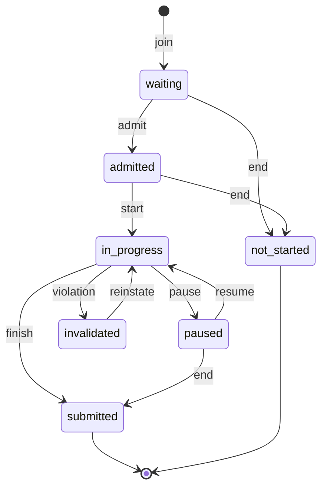
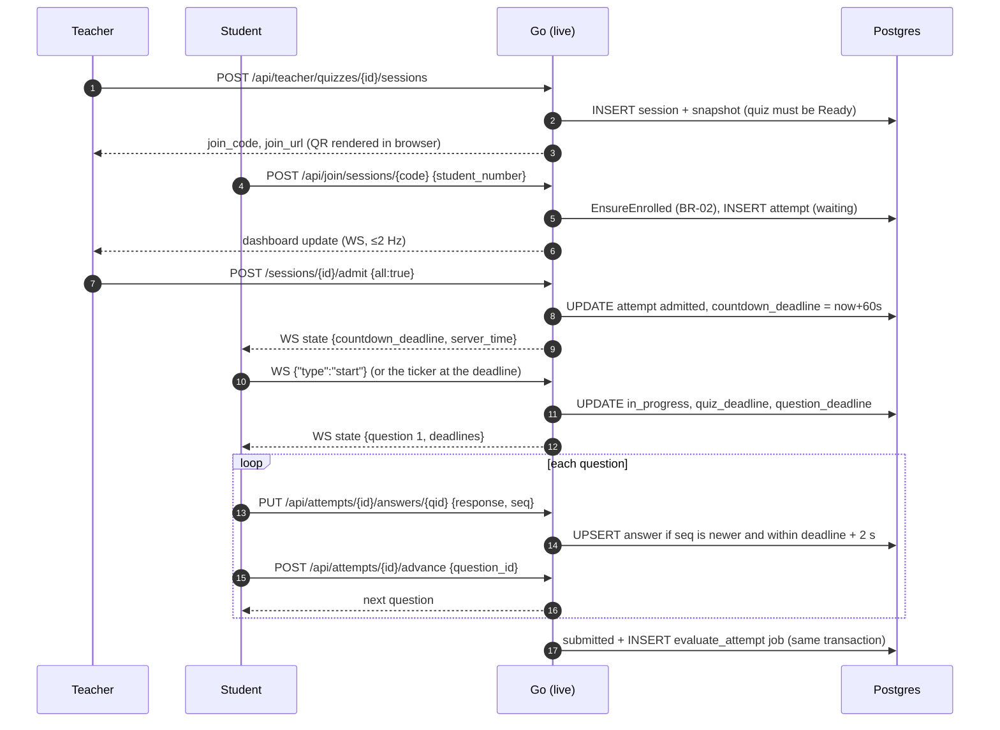

# Live sessions & timing

Code: `backend/internal/live`. Requirements: FR-SS-01…12, UC-02, UC-03, ADR-04, ADR-05, ADR-07.

## Attempt lifecycle

| Transition | Triggered by |
|------------|--------------|
| join | Student scans the QR or enters the code (`POST /api/join/sessions/{code}`) |
| admit | Teacher admits one, a group or all; automatic under `admission_mode = auto` |
| start | The countdown reaches zero (ticker), or the student presses Start |
| pause / resume | Teacher, for one, a selection or all students |
| finish | Last question answered, quiz time up, student submits, or the session ends |
| violation | A detected signal under `invalidate` (or once warnings run out under `warn_then_invalidate`) |
| reinstate | Teacher, with a logged reason, before the session ends |
| end | The session ends before the student started (or while paused, which submits) |

`submitted`, `invalidated` (unless reinstated before the session ends) and `not_started` are final. Session status moves `open` → `live` (on the first admission) → `ended`. The QR link works while the session is open or live (BR-04).

## The happy path

## How a transition works

Every change goes through `Service.change(ctx, attemptID, fn)`:

1. Begin a transaction and `SELECT … FOR UPDATE` the attempt row. This serialises all actions on one attempt: a teacher pause, a student save and the ticker can't interleave.
2. Copy the cached session (`sessionView`), because the cache can change concurrently.
3. Run `fn`, which mutates the attempt using the pure helpers in `timing.go` and writes events or violations in the same transaction. Returning `errNoop` skips the write and the broadcast.
4. `saveAttempt` and commit.
5. **After commit**, `hub.publishAttempt` sends the student their new full state and marks the session dashboard dirty.

Bulk teacher commands (`admit`, `pause`, `resume`, `extend`) select target ids and apply `change` to each.

## Timing rules (ADR-07, BA §7)

The server owns all time. Deadlines are `timestamptz`; the browser only renders `deadline − (Date.now() + offset)`, where the offset comes from WebSocket ping/pong (`frontend/src/lib/clock.ts`).

| Rule | Implementation |
|------|----------------|
| Countdown after admission (default 60 s) | `admit()` sets `countdown_deadline`; a 0-second countdown starts immediately |
| Quiz limit | `start()` sets `quiz_deadline = now + limit + session extension + student extension` |
| Session duration overrides the quiz's | Ordinary settings resolution: the session layer wins |
| Question limit | `question_deadline = shown_at + limit`, stored uncapped; `EffectiveQuestionDeadline` = min(question, quiz) |
| Quiz limit ends the attempt whatever question is open (AC-05) | `expire()` checks the quiz deadline first |
| Question time up: keep the answer, move on (AC-04) | `expire()` calls `advance()` |
| Saves accepted until deadline + 2 s | `acceptsAnswers()` with `Grace = 2s` |
| Paused time never counts (AC-07) | `pause()` stores remaining ms and clears deadlines; `resume()` restores them from `now` |
| Extension for one student (AC-08) | adds to `extension_sec` and shifts the deadline (or the remaining ms while paused) |
| Session-wide extension | `sessions.extension_sec += x` and shifts every running attempt; later starters get it at `start()` |
| No quiz limit | No deadline; the attempt ends at the last question or when the session ends (D-20) |
| Free navigation | If `one_way_navigation` is false, `Goto` is allowed and per-question limits are ignored (D-17) |

## The ticker

`Service.Run` starts a 1 Hz `Tick` and a 2 Hz dashboard flush. Instead of a timer per student, `Tick` runs indexed queries for what is due (D-19):

1. `admitted` attempts whose countdown has passed: start them.
2. `in_progress` attempts whose quiz or question deadline plus grace has passed, or that are disconnected: `expire()`.
3. `live` sessions where every attempt is finished and nothing changed for 2 minutes (`AutoEndQuiet`): end them (D-18).

Because all of this is derived from Postgres, a restarted process picks up exactly where the old one stopped.

## The hub

`Hub` keeps sockets per attempt (students) and per session (teachers). Each socket has a 32-message outbound queue; a client that falls behind is disconnected rather than slowing everyone down. Student messages are full snapshots (`StudentState`), so a reconnecting client always resumes from server state. Teacher dashboards are rebuilt at most twice a second (one query per busy session); violation **alerts** are pushed immediately (AC-06). The message formats are in [WebSocket protocol](realtime.md).

## Ordering and shuffling

At join time `newOrders` creates the attempt's question order (`question_order = shuffled`) and per-question option orders. MATCH right-hand items and DRAG items are **always** shuffled, because their authored order would reveal the answer; an ordering question is never shown already solved (D-23). `applyOrder` applies the stored order when building the student view.

## Ending, release, reinstating

- `End` (or auto-end) submits running and paused attempts, marks waiting and admitted ones `not_started`, writes `session_ended`, and calls the `SessionEnded` hook (evaluate invalidated attempts, recompute analytics).
- `Reinstate` requires a reason, only works for the owning teacher (BR-08) while the session is not ended, and is audited. Deadlines are unchanged, so extend afterwards if needed.
- `Release` and `Unrelease` set or clear `released_at`. See [Marking & feedback](marking.md#release).
