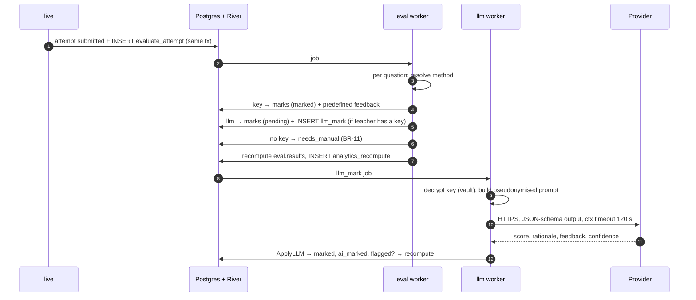

# Marking & feedback

Code: `backend/internal/eval` (marking, results) and `backend/internal/llm` (LLM gateway). Requirements: FR-EV-01…09, UC-04, BR-10…12, NFR-01/05/16, ADR-06, ADR-09, ADR-16.

## Pipeline

## Choosing the method

`method(question, effective.EvaluationMethod)`:

- `manual` stays manual.
- ESSAY is always `llm`; essays cannot be key-marked (D-14).
- `llm` only applies to ESSAY and BLANK_TEXT; any other type falls back to `key`.
- An **unanswered** question scores 0 by every method, with no LLM call.
- `llm` with no usable key becomes `needs_manual` (BR-11), and the teacher marks it.

## Key-marking rules

`MarkByKey(question, response)` returns score, max, fraction, correct and answered (D-24):

| Type | Fraction |
|------|----------|
| SINGLE | 1 if the one selected option is the key |
| MULTI | (right picks − wrong picks) / number of correct options, floored at 0 |
| MATCH, DRAG zones | share of pairs correct |
| BLANK_OPT | share of blanks with the right option |
| BLANK_TEXT | share of blanks matching an accepted answer, ignoring case (unless `case_sensitive`) and repeated spaces, within `tolerance` edits; no tolerance for answers of 3 characters or fewer |
| DRAG order | share of items in the right position |

Without partial credit, anything short of fully correct scores 0. With `negative_marks`, an **answered** question earning nothing scores −negative marks. The attempt total is floored at 0. Defaults: SINGLE and MULTI have no partial credit; the other types do.

## Feedback

- **Predefined** (`PredefinedFeedback`): per selected option or blank, then correct/incorrect text, then the matching score band.
- **AI**: when `feedback_mode` is `ai` or `both` on a key-marked answered question, an `llm_mark` job with `mode: "feedback"` asks the model for feedback only, telling it the fixed score. LLM-marked answers get feedback with the mark.

## The LLM gateway

**Keys** (`llm/vault.go`, ADR-09):
- Each key is encrypted with a fresh 256-bit DEK using AES-GCM, with AAD `teacher_id|provider|version`. The DEK is wrapped with the KEK from the master key file.
- Only ciphertext, the wrapped DEK, nonces, the KEK id and the last 4 characters are stored.
- The API offers list (masked), add, update, test and delete, but never a read (BR-10, AC-11).
- Plaintext exists only inside `Service.call` and is zeroed afterwards.

**Prompt** (`llm/prompt.go`, ADR-16):
- The provider receives the question, model answer, rubric and the student's answer under a **pseudonym** (`student-xxxxxx`).
- Emails and phone numbers are scrubbed when the request is built.
- The answer sits in a delimited `<student_answer>` block, with look-alike closing tags neutralised, and the system prompt says to treat it as data.
- Output is forced to a JSON schema (`score`, `rationale`, `feedback`, `confidence`).

**Check** (`Check`): the score is clamped to the question's range and rounded. The answer is flagged for review if the score was out of range, the answer looks like instructions to the marker, a very short answer scored above half marks, or confidence was below 0.5.

**Providers** (`llm/providers.go`):

| Provider | Transport | Default model |
|----------|-----------|---------------|
| `anthropic` | Official Go SDK, `OutputConfig.Format` JSON schema, effort `medium` | `claude-opus-5-5` |
| `openai` | `POST /v1/chat/completions`, `response_format: json_schema` | must be set |
| `google` | `POST /v1beta/models/{model}:generateContent`, key in `x-goog-api-key` | must be set |

**Errors and retries** (ADR-06, D-30):

| Outcome | Handling |
|---------|----------|
| 401/403, 402, 400/404/422, quota exhausted, refusal | `PermanentError`: `LLMFailed` sets `needs_manual` with a flag, then `river.JobCancel` |
| 429 rate limit, 5xx, 529 overloaded, network | Returned so River retries with backoff; after attempt 4 the answer goes to manual |
| Teacher over 10 calls burst / 1 per 2 s | `river.JobSnooze(15s)` |

Jobs are unique by `(teacher, attempt, question, mode, key, model)` while queued or running, so a re-enqueue cannot bill twice. The worker overrides River's 1-minute default with a 120 s `Timeout`.

## Review and overrides

`GET /api/teacher/sessions/{id}/results` lists every finished attempt with its marks, responses and keys. `PUT /api/teacher/marks/{attempt}/{question} {score?, feedback?}` sets status `overridden`, is audited, and recomputes totals. Re-evaluation and late AI results never replace an override; the teacher is the final authority. `POST …/remark` re-queues LLM marking (FR-EV-09).

`GET /api/teacher/sessions/{id}/llm-estimate` reports how many answers need the LLM and a rough token count (NFR-16).

## Release

Students see results only when `released()` is true (BR-12):

- `released_at` is set (the teacher pressed Release), or
- `results_release = immediate` and the attempt is finished, or
- `results_release = on_session_end` (default) and the session has ended.

`manual` waits for the teacher. A release can be undone (D-25). The student view (`StudentResult`) shows answers, correct answers (the rubric is always removed) and feedback according to `results_show_*` (D-26), plus a "marking in progress" state while marks are pending and an AI-marked badge per answer.

## Invalidated attempts

They are not marked when invalidated (the teacher may reinstate). At session end the `SessionEnded` hook queues `evaluate_attempt` for them, so teachers can review their answers. They are reported with `invalidated = true`, never pass, and are excluded from pass rates (D-27).
