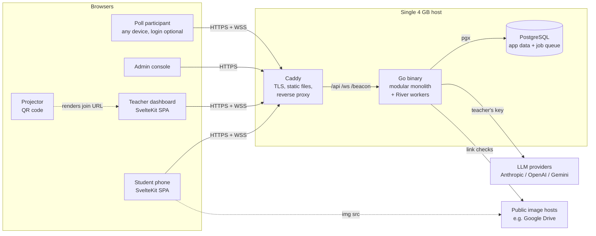

# Overview

The QR Classroom Quiz Platform runs timed, proctored quizzes in a classroom. A teacher projects a QR code, students scan it with their phones, the teacher admits them, and each student answers one question at a time against server-enforced timers. Answers are marked by answer key, by an LLM using the teacher's own API key, or by the teacher, and results are published privately or on a revocable public page.

Alongside quizzes, teachers run **live polls**: ungraded questions of 20 input types (word clouds, ratings, Likert scales, matrices, file and voice answers…) that anyone can answer with a code, anonymously or under their name, with results that update live on the presenter's screen ([Live polls](polls.md)).

These pages describe how the system is built so you can change it safely. The product requirements live in the Business Analysis document and the architecture rationale in the Architecture document (ADRs). Both are private and are not in the repository; teams keep them in a local, git-ignored `docs/` folder. Requirement IDs such as **FR-SS-05**, business rules such as **BR-12** and decisions such as **ADR-07** refer to those documents; **D-nn** refers to the [decision log](decisions.md).

## The system in one picture

## Who uses it

| Role | What they do | Key restriction |
|------|--------------|-----------------|
| **Student** | Registers, enrols in classrooms, scans a QR to join a session, answers, sees released results | Cannot leave the quiz tab once started (proctoring) and never receives answer keys before release (BR-12) |
| **Teacher** | Builds classrooms → modules → topics → quizzes, imports questions from CSV, runs live sessions, marks, publishes results, runs polls | Sees only their own data (BR-14) |
| **Poll participant** | Anyone with a poll code: answers anonymously, or logged in when the poll identifies people | Never sees other participants' names or files (D-40) |
| **Admin** | Manages accounts, platform defaults and policy; reads usage and the audit log | Cannot read teachers' API keys or quiz content |

## Technology

| Layer | Choice | Why (ADR) |
|-------|--------|-----------|
| Backend | Go, one binary, Chi router | Low memory, goroutine per WebSocket (ADR-01, ADR-02) |
| Database | PostgreSQL 16/17 | Concurrent writes, JSONB, LISTEN/NOTIFY, transactional job enqueue (ADR-03) |
| Jobs | River (Postgres-backed queue) | Marking, analytics and email survive restarts; enqueued in the same transaction (ADR-06) |
| Real time | WebSockets via `coder/websocket` | Bidirectional, safe concurrent writes (ADR-04) |
| Frontend | SvelteKit static SPA (`adapter-static`) | No Node server; ~54 KB gzipped JS for the student quiz page (ADR-11) |
| Edge | Caddy 2 | Automatic HTTPS, WebSocket proxying, precompressed static files (ADR-12) |

## Repository layout

| Path | Contents |
|------|----------|
| `backend/cmd/server` | The server binary (also `create-admin`) |
| `backend/cmd/testdb` | A long-running embedded PostgreSQL for fast local test runs |
| `backend/internal/<module>` | One package per module; see [Backend modules](backend-modules.md) |
| `backend/internal/platform` | Shared plumbing: config, db, migrations runner, HTTP helpers, jobs, audit, test harness |
| `backend/migrations` | Numbered SQL migrations, embedded into the binary |
| `frontend/src/routes` | SvelteKit pages (student, teacher, admin, public, these docs) |
| `frontend/src/lib` | API client, socket, timers, offline answer queue, proctoring, shared components |
| `deploy/` | Caddyfile, systemd units, PostgreSQL tuning, backup script |
| `loadtest/` | k6 classroom scenario |
| `DECISIONS.md` | The decision log |
| `docs/` (git-ignored) | Private BA and architecture documents, kept locally only |

## Where to go next

- New to the code? Start with [Getting started](getting-started.md), then [Architecture](architecture.md).
- Changing a quiz flow? Read [Live sessions & timing](live-sessions.md) and [Proctoring](proctoring.md).
- Touching marking? Read [Marking & feedback](marking.md).
- Calling the API? See [HTTP API](api.md) and the [Swagger UI](/api/docs).
