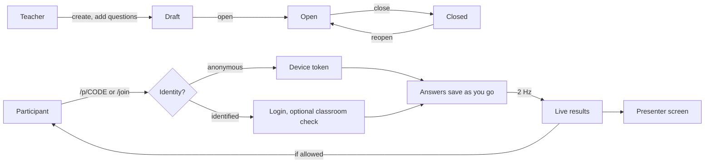

# Live polls

Code: `backend/internal/poll` (schema `poll`, migration `0009_poll.sql`) and `frontend/src/lib/poll`. Decision: D-40.

Polls are quick, ungraded questions for any audience: a word cloud to open a lesson, a rating to close it, a Likert scale for feedback. They sit beside quizzes rather than inside them, because they have no answer keys, no marks and no proctoring, and they must work without a login.

## How a poll runs

The teacher chooses four things:

| Setting | Values | Meaning |
|---------|--------|---------|
| `identity` | `anonymous`, `identified`, `optional` | Anonymous: no login and **no account is stored, even for a logged-in user**. Identified: login required; the teacher sees names. Optional: each participant chooses. |
| `audience` | `anyone`, `classroom` | Classroom-only polls require `identified` and an active enrolment. |
| `pacing` | `self`, `presenter` | Self-paced shows every question. Presenter-led shows only the current one, moved by the presenter screen. |
| `show_results` | `live`, `after_answer`, `presenter`, `never` | What participants see. The teacher always sees everything. |

`allow_edit` decides whether answers can change while the poll is open. Identity can't change once someone has joined; **Clear responses** resets the poll.

Participants never see names, participant ids, uploaded files or moderated answers, whatever the identity mode.

## Question types

All seven quiz types plus thirteen poll inputs (20 in all). The participant UI reuses `QuestionView` for the quiz-style ones.

| Group | Types | Input | Results |
|-------|-------|-------|---------|
| Choice | `SINGLE` (radios or dropdown), `MULTI` (optional max) | Letter tiles, dropdown | Bars with shares |
| Scale | `RATING` (3–10 stars), `SLIDER`, `LIKERT` (5 or 7 points, many statements), `MATRIX` (radios, checkboxes or text boxes) | Accessible radio groups, a range that only counts once moved, tables that become cards on phones | Histogram with mean and median; diverging stacked bars; heat grid |
| Text | `WORD_CLOUD` (1–5 entries), `SHORT_TEXT`, `ESSAY`, `CODE` | Chips, inputs, a code editor (Tab indents; Esc then Tab leaves) | Live word cloud; answer cards |
| Number & time | `NUMBER` (range, step, unit), `DATE`, `TIME` | Native pickers | Histogram; values in order |
| Quiz-style | `MATCH`, `BLANK_OPT`, `BLANK_TEXT`, `DRAG` (rank or sort into boxes) | As in quizzes | Heat grid; word list per blank; average rank |
| Media | `FILE`, `AUDIO`, `VIDEO` | Drop zone; in-browser recording (MediaRecorder) | Teacher-only players and downloads |

Answer JSON uses one field per kind: `selected`, `pairs`, `blanks`, `order`, `text`, `words`, `number`, `date`, `time`, `rows` (Likert point or matrix column per row), `multi`, `cells` (`"row|column"` → text) and `file` (set only by the upload). `CheckAnswer` validates every type, keeps only the fields it uses, and treats an empty value as "clear my answer".

Word-cloud entries are normalised: lower case, and punctuation turned into spaces (apostrophes and hyphens inside words are kept), so "Fun!" and "fun" count together.

## Live results

`poll.Hub` keeps presenter and participant sockets in memory, like the live-session hub (ADR-05). An answer marks its question dirty; twice a second the hub recomputes **only dirty questions**, caches the aggregates, and pushes:

- `results` to presenters (`/ws/teacher/polls/{id}`): names, moderated items flagged, file lists;
- one shared `update` to all participants (`/ws/polls/{code}`): no answers and no identities.

The participant socket is read-only and carries no identity; answers go over REST. Because every participant gets the same update, "after answering" is applied by each browser to its own view, so it is a display rule, not secrecy. `never` is enforced on the server. This keeps 200 participants at one computation per change instead of 200.

## Moderation and export

- Hide one answer (text, file or any other) or one word of a word cloud. Hidden items disappear from shared results and stop counting; the teacher still sees them, dimmed.
- `GET /api/teacher/polls/{id}/export.csv` has one row per participant and one column per question. Cells that start with `= + - @` are prefixed with `'` so spreadsheets don't run them as formulas.

## Files, audio and video

- Stored in PostgreSQL (`poll.files`) and deleted with the answer, question or poll.
- Limits:
  - files up to 5 MB, set per question;
  - audio up to 60 s, at most 3 MB;
  - video up to 30 s, at most 12 MB;
  - 200 MB per poll.
- The type is decided by **sniffing the bytes**. Images, PDF, text and Office/OpenDocument files are accepted, the latter only with the right extension; audio and video must be WebM, Ogg, MP4, MP3 or WAV. An HTML page renamed to `.png` is rejected.
- Only the poll owner can download. Downloads are sent with `Content-Security-Policy: sandbox`, `nosniff` and `Cache-Control: no-store`. Only images, audio and video are shown inline; everything else downloads as an attachment.
- Recording needs a secure context (HTTPS or localhost) and the participant's permission. Video is captured at 640×360, 15 fps, about 1.2 Mbit/s.

## Anonymous participants

Joining an anonymous poll returns a random 256-bit token. Only its SHA-256 is stored, and the browser keeps the token in `localStorage` under `qp:poll:CODE` and sends it as `X-Poll-Token`. The token can only answer as that participant in that poll; login sessions remain HttpOnly cookies (ADR-13). Nothing stops someone from joining twice in a private window: anonymous polls count devices, not people. Joins are rate-limited per IP address and answers per participant.

## Security notes

- Every REST call goes through the same CSRF checks as the rest of the API (`X-Requested-With` and `Origin`), with or without a login.
- Question text uses the rich-text dialect and renderer (D-38).
- Polls are capped at 50 questions and 2,000 participants.
