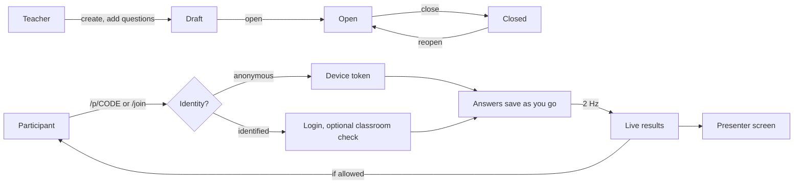

# Live polls

Code: `backend/internal/poll` (schema `poll`, migrations `0009_poll.sql`, `0011_poll_scoring.sql` and `0012_poll_groups.sql`) and `frontend/src/lib/poll`. Decisions: D-40, D-42 (scoring), D-43 (groups).

Polls are quick, ungraded questions for any audience: a word cloud to open a lesson, a rating to close it, a Likert scale for feedback. They sit beside quizzes rather than inside them, because they have no answer keys, no marks and no proctoring, and they must work without a login.

## How a poll runs

The teacher chooses four things:

| Setting | Values | Meaning |
|---------|--------|---------|
| `identity` | `anonymous`, `identified`, `optional` | Anonymous: no login and **no account is stored, even for a logged-in user**. Identified: login required; the teacher sees names. Optional: each participant chooses. |
| `audience` | `anyone`, `classroom` | Classroom-only polls require `identified` and an active enrolment. |
| `pacing` | `self`, `presenter` | Self-paced shows every question. Presenter-led shows only the current one, moved by the presenter screen. |
| `show_results` | `live`, `after_answer`, `presenter`, `never` | What participants see. The teacher always sees everything. |

`allow_edit` decides whether answers can change while the poll is open. Identity can't change once someone has joined; **Clear responses** resets the poll.

Participants never see names, participant ids, uploaded files or moderated answers, whatever the identity mode.

## Question types

All seven quiz types plus thirteen poll inputs (20 in all). The participant UI reuses `QuestionView` for the quiz-style ones.

| Group | Types | Input | Results |
|-------|-------|-------|---------|
| Choice | `SINGLE` (radios or dropdown), `MULTI` (optional max) | Letter tiles, dropdown | Bars with shares |
| Scale | `RATING` (3–10 stars), `SLIDER`, `LIKERT` (5 or 7 points, many statements), `MATRIX` (radios, checkboxes or text boxes) | Accessible radio groups, a range that only counts once moved, tables that become cards on phones | Histogram with mean and median; diverging stacked bars; heat grid |
| Text | `WORD_CLOUD` (1–5 entries), `SHORT_TEXT`, `ESSAY`, `CODE` | Chips, inputs, a code editor (Tab indents; Esc then Tab leaves) | Live word cloud; answer cards |
| Number & time | `NUMBER` (range, step, unit), `DATE`, `TIME` | Native pickers | Histogram; values in order |
| Quiz-style | `MATCH`, `BLANK_OPT`, `BLANK_TEXT`, `DRAG` (rank or sort into boxes) | As in quizzes | Heat grid; word list per blank; average rank |
| Media | `FILE`, `AUDIO`, `VIDEO` | Drop zone; in-browser recording (MediaRecorder) | Teacher-only players and downloads |

Answer JSON uses one field per kind: `selected`, `pairs`, `blanks`, `order`, `text`, `words`, `number`, `date`, `time`, `rows` (Likert point or matrix column per row), `multi`, `cells` (`"row|column"` → text) and `file` (set only by the upload). `CheckAnswer` validates every type, keeps only the fields it uses, and treats an empty value as "clear my answer".

Word-cloud entries are normalised: lower case, and punctuation turned into spaces (apostrophes and hyphens inside words are kept), so "Fun!" and "fun" count together.

## Live results

`poll.Hub` keeps presenter and participant sockets in memory, like the live-session hub (ADR-05). An answer marks its question dirty; twice a second the hub recomputes **only dirty questions**, caches the aggregates, and pushes:

- `results` to presenters (`/ws/teacher/polls/{id}`): names, moderated items flagged, file lists;
- one shared `update` to all participants (`/ws/polls/{code}`): no answers and no identities.

The participant socket is read-only and carries no identity; answers go over REST. Because every participant gets the same update, "after answering" is applied by each browser to its own view, so it is a display rule, not secrecy. `never` is enforced on the server. This keeps 200 participants at one computation per change instead of 200.

## Adding questions while live

A question can be added to an open poll at any time (V2-05, D-46). The presenter screen has **Add question** (`N`), which opens the full question editor with two choices: **Put it next** (`after_id`: insert after the question on screen; `after_current` does the same for the presented question) and **Show it now** (presenter pacing: everyone moves to it; self-paced: the presenter screen jumps to it). Participants receive it on the hub's next flush, within half a second, without reloading. Answers and positions of the other questions are untouched; a self-paced presenter screen keeps showing the same question when one is inserted before it.

## Whiteboard

Every poll has a whiteboard (V2-09, D-47), opened from the presenter screen (**Board**, `B`).

- **Tools.** Pen, highlighter, line, arrow, rectangle, ellipse, text and an eraser; eight ink colours and three sizes; undo (`Ctrl+Z`); clear (teacher); **PNG** export at 1920×1080. Coordinates are on a fixed 1600×900 board, so marks look the same on every screen.
- **Who sees and draws.** The board is hidden from participants until the teacher turns on **Show the board to participants**. Who may draw: only the teacher (default), everyone, or selected groups and participants. Participants can erase and undo only their own marks; the teacher can erase anything.
- **Real time.** Strokes are saved over REST (`/board/strokes`, at most 20 per request, rate-limited per participant) and pushed at once to every open socket of the poll as `board` events (`add`, `remove`, `clear`, `access`), without waiting for the results flush. Pen lines are sent in pieces every 200 ms while being drawn, so viewers see them grow; pieces share a gesture id, so undo removes the whole line. Late joiners load every stroke with `GET /board`.
- Stroke `by` is "t" for the teacher or the participant's opaque key, so a browser can recognise its own marks without ids being published.

## Scoring and leaderboard

Turning on **Score answers** (`scoring`) makes a poll a competition (V2-01, V2-02, D-42). Questions with an answer key earn points; opinion types (word cloud, rating, Likert, matrix, essay, code, media) are never scored.

| Setting | Values | Meaning |
|---------|--------|---------|
| `speed_bonus` | on, off | Presenter-led questions with a time limit: a right answer earns 50–100% of its points, linearly over the time limit. |
| `leaderboard` | `off`, `presenter` (default), `everyone` | Who sees the ranking. `everyone` sends the top 10 in the shared update; each participant's own place comes from their personal view. |
| `show_answers` | `never`, `after_answer`, `presenter`, `after_close` | When participants see the correct answer. `presenter` needs presenter pacing and follows the **Show answer** button. |
| `names` | `nickname` (default), `name` | Leaderboard names. `name` shows the account name of logged-in participants and is not allowed in anonymous polls. Without a nickname a participant is "Participant N". |

Per question: `key` (shape by type, below), `points` (0–10,000, default 100) and, for presenter pacing, `time_limit_sec` (5–3,600). Answers after the limit (plus 2 s grace) get `409 time_up`.

| Types | Key | Partial credit |
|-------|-----|----------------|
| `SINGLE`, `MULTI` | `correct`: option ids | MULTI: (right − wrong) / correct, floored at 0, as in quizzes (D-24) |
| `MATCH`, `DRAG` into boxes | `pairs` | Share of pairs right |
| `DRAG` ranking | `order` | Share of items in place |
| `BLANK_OPT`, `BLANK_TEXT` | `blanks`: blank → accepted option ids or words | Share of blanks right |
| `SHORT_TEXT` | `accepted`, `case_sensitive` | None |
| `NUMBER`, `SLIDER` | `value`, `tolerance` | None |
| `DATE`, `TIME` | `accepted` | None |

Ranking: points, then right answers, then who gave their last scored answer first, then join order. Equal points and right answers share a rank (1, 2, 2, 4). Hidden (moderated) answers don't count.

**Keeping keys secret.** The key is stripped from every participant-facing question. Revealed keys travel in `keys`:

- `after_answer`: only in the participant's own answer response and personal view, never in the shared update;
- `presenter`: in the shared update while the presenter shows the answer of the current question;
- `after_close`: once the poll is closed.

Once a participant can see a key, their answer to that question is locked (`409 answer_revealed`), so seeing the answer can't improve a score.

Leaderboard rows carry an opaque `key` (a hash of poll and participant), so a browser can find itself (`me_key`) without participant ids being published. Teachers also get the participant id, nickname and real name, and can rename a participant through the moderation endpoint.

The presenter screen adds a countdown, **Show answer** (`A`; with `show_answers=presenter` it reveals to everyone, otherwise to this screen only) and a full-screen **Leaderboard** (`L`).

## Groups

Polls can run as a group competition (V2-06, V2-07, D-43). `groups` decides how groups form:

| Value | Formation |
|-------|-----------|
| `off` | No groups. |
| `manual` | The teacher creates groups and moves participants on the **Groups** tab. |
| `random` | Each new participant joins the smallest group (random among equals). **Make random groups** creates N groups and spreads everyone without a group, or everyone with **Also move people who have a group**. |
| `categories` | One group per category of the poll's classroom (name and colour copied). Logged-in students join the group of their first category; others stay ungrouped. Needs a classroom and a non-anonymous poll. |
| `self` | Participants pick a group on the join screen; it is required once groups exist. They can switch until they answer. |

`group_acceptance` decides which answers count for the group:

- `all`: every member answers; `group_calc` combines their points per question: `sum`, `average`, `max` or `min`. Average and lowest count members who didn't answer as 0, so a group can't raise its mark by letting only its strongest member answer.
- `first`: the group's first answer counts. Once a member has answered, teammates get `409 group_answered`; a row lock on the group stops two simultaneous answers. The answerer can still change or clear it.
- `captain`: only the captain answers (`409 captain_only` for others). The earliest member becomes captain; the teacher can hand it over.
- `best`: every member answers and the group gets its best mark.

In first-answer and captain groups, members see the group's answer (and who gave it) in their personal view, `group_answers`. Participants without a group answer for themselves and appear only on the individual leaderboard.

A public live link (Share tab) shows the leaderboards to anyone, by nickname or as "Participant N"; see [Analytics](analytics.md#live-leaderboard-links).

The group leaderboard (`group_leaderboard`) sums each group's question marks; equal scores share a rank. It goes to the teacher, the presenter screen (beside the individual one) and, with `leaderboard=everyone`, to participants, who see their group highlighted. Groups expose only their id, name, colour and size to participants, never members.

## Moderation and export

- Hide one answer (text, file or any other) or one word of a word cloud. Hidden items disappear from shared results and stop counting; the teacher still sees them, dimmed.
- `GET /api/teacher/polls/{id}/export.csv` has one row per participant and one column per question. Cells that start with `= + - @` are prefixed with `'` so spreadsheets don't run them as formulas.

## Files, audio and video

- Stored in PostgreSQL (`poll.files`) and deleted with the answer, question or poll.
- Limits:
  - files up to 5 MB, set per question;
  - audio up to 60 s, at most 3 MB;
  - video up to 30 s, at most 12 MB;
  - 200 MB per poll.
- The type is decided by **sniffing the bytes**. Images, PDF, text and Office/OpenDocument files are accepted, the latter only with the right extension; audio and video must be WebM, Ogg, MP4, MP3 or WAV. An HTML page renamed to `.png` is rejected.
- Only the poll owner can download. Downloads are sent with `Content-Security-Policy: sandbox`, `nosniff` and `Cache-Control: no-store`. Only images, audio and video are shown inline; everything else downloads as an attachment.
- Recording needs a secure context (HTTPS or localhost) and the participant's permission. Video is captured at 640×360, 15 fps, about 1.2 Mbit/s.

## Anonymous participants

Joining an anonymous poll returns a random 256-bit token. Only its SHA-256 is stored, and the browser keeps the token in `localStorage` under `qp:poll:CODE` and sends it as `X-Poll-Token`. The token can only answer as that participant in that poll; login sessions remain HttpOnly cookies (ADR-13). Nothing stops someone from joining twice in a private window: anonymous polls count devices, not people. Joins are rate-limited per IP address and answers per participant.

## Security notes

- Every REST call goes through the same CSRF checks as the rest of the API (`X-Requested-With` and `Origin`), with or without a login.
- Question text uses the rich-text dialect and renderer (D-38).
- Polls are capped at 50 questions and 2,000 participants.
