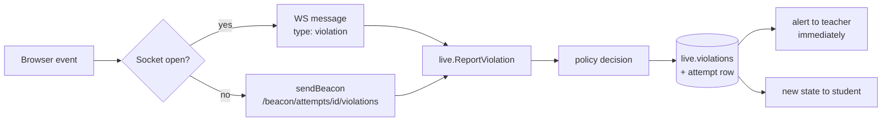

# Proctoring

Browser-based integrity checks (FR-PR-01…06, BR-07, ADR-08). **They detect and report; they cannot prevent cheating.** A second device, split-screen on some Android builds, and overlay apps are invisible to a web page, and notifications or screen locks can cause false positives. Teachers need to know this, and the configurable policy and reinstatement exist because of it.

## Signals

| Signal | Kind sent | Where detected | Notes |
|--------|-----------|----------------|-------|
| Tab or app switch, minimise, screen off | `tab_hidden` | `visibilitychange` → `hidden` | Sent with `navigator.sendBeacon`, because the page may be frozen right after |
| Focus lost (another window, overlay) | `window_blur` | `blur`, still blurred after `blur_grace_ms` | Short blurs (default < 2 s) are ignored (R-01) |
| Reload or close | `page_close` | `pagehide` | Beacon |
| Left fullscreen | `fullscreen_exit` | `fullscreenchange` | Only after fullscreen was entered; iPhone Safari has no page fullscreen, so this is optional evidence |
| Socket gone and not back in time | `disconnected` | Server | Set when the last socket of an attempt closes; the ticker raises it after `disconnect_grace_sec` (default 10 s) if no socket returned |

Client code: `frontend/src/lib/proctor.ts`. It is active only while the attempt is `in_progress` and dedupes the same kind within 1 s (a single tab switch fires blur and visibilitychange together). It also blocks copy, cut, paste and the context menu during an attempt (FR-PR-06), and the attempt page asks for fullscreen when the student presses Start (FR-PR-01).

## Delivery

The beacon route lives outside `/api` because `sendBeacon` cannot set the CSRF header. It checks `Origin` and the session cookie instead, and takes the JSON body as `text/plain` to avoid a CORS preflight.

## Policy

`decide(policy, allowedWarnings, warningsSoFar)` in `timing.go`:

| `violation_policy` | Effect |
|--------------------|--------|
| `invalidate` (default) | The attempt becomes `invalidated`; questions disappear for the student |
| `warn_then_invalidate` | The first `allowed_warnings` violations increment `warnings` (the student sees a warning); the next one invalidates |
| `log_only` | Recorded and alerted, nothing else |

Every violation is stored in `live.violations` with server time, the client's timestamp (evidence only), the user agent and the action taken (FR-PR-04), and appears in the session's integrity log. Violations are ignored while an attempt is paused or not yet started (D-20).

## Reinstatement

`POST /api/teacher/attempts/{id}/reinstate {reason}` returns an invalidated attempt to `in_progress` (FR-SS-12). Only the owning teacher can do it (BR-08), it is written to the audit log, and it is not possible after the session has ended. Time kept running while the attempt was invalidated, so the teacher may need to extend.

## Testing it

`live_api_test.go` covers AC-06 with a real WebSocket alert, warn-then-invalidate, log-only and session overrides, the beacon path, and the disconnect rule in both directions. `lib.test.ts` covers the client: hidden tab via beacon, the blur grace period, and inactivity outside attempts.
