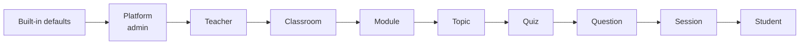

# Configuration hierarchy

Every level of the content tree can override settings, and the most specific level that sets a value wins (BA §7, ADR-14). Code: `backend/internal/settings/settings.go`; UI metadata: `frontend/src/lib/settingsMeta.ts`.

## Resolution order



Later layers win. Note that **Session overrides Question**, as the BA order specifies: a session can tighten the quiz limit, but question-only keys such as `question_time_limit_sec` cannot be set at session level anyway.

```go
// Effective settings for one student on one question during a session:
eff := sess.Effective(&question, attempt.Overrides)
// = Resolve(snapshot.Base, classroom, module, topic, quiz, question, session, student)
```

## Storage

| Level | Stored in |
|-------|-----------|
| Platform | `settings.platform.overrides` |
| Teacher | `settings.teacher.overrides` |
| Classroom / module / topic | `content.*.settings` |
| Quiz / question | `quiz.quizzes.settings`, `quiz.questions.settings` |
| Session | `live.sessions.settings` (editable while live) |
| Student | `live.attempts.overrides` |

When a session is created, defaults, platform, teacher and the classroom-to-quiz layers are frozen into the snapshot. Later edits to those levels do not affect running sessions; that is intended (ADR-14) and the UI says so.

## Keys

`Overrides.Validate(level)` rejects keys that are not allowed at the level being written (the platform level may set anything) and checks enums and ranges. The API returns 422 with `fields["settings.<key>"]`.

| Key | Levels | Default | Values |
|-----|--------|---------|--------|
| `countdown_seconds` | teacher, classroom, quiz, session | 60 | 0–3600 |
| `question_time_limit_sec` | quiz, question | 0 (none) | seconds |
| `quiz_time_limit_sec` | topic, quiz, session, student | 0 (none) | seconds |
| `admission_mode` | classroom, session | `manual` | `manual`, `auto` |
| `evaluation_method` | teacher, quiz, question | `key` | `key`, `llm`, `manual` |
| `llm_key_id`, `llm_model` | teacher, quiz, question | teacher default key/model | |
| `feedback_mode` | teacher, quiz, question | `predefined` | `none`, `predefined`, `ai`, `both` |
| `violation_policy` | classroom, quiz, session | `invalidate` | `invalidate`, `warn_then_invalidate`, `log_only` |
| `allowed_warnings` | classroom, quiz, session | 1 | used by `warn_then_invalidate` |
| `blur_grace_ms` | classroom, quiz, session | 2000 | ignore shorter focus losses (R-01) |
| `disconnect_grace_sec` | classroom, quiz, session | 10 | heartbeat rule |
| `question_order` | quiz, session | `fixed` | `fixed`, `shuffled` |
| `option_order` | quiz, question | `fixed` | `fixed`, `shuffled` |
| `one_way_navigation` | quiz | true | BR-09 |
| `results_visibility` | quiz, session | `private` | `private`, `public` |
| `results_view` | quiz, session | `individual` | `individual`, `question_pct`, `pass_rate` |
| `results_release` | quiz, session | `on_session_end` | `immediate`, `on_session_end`, `manual` |
| `results_show_answers` / `_correct` / `_feedback` | quiz, session | true | D-26 |
| `pass_mark_pct` | classroom, quiz | 50 | 0–100 |
| `student_id_required` | classroom | false | FR-CLS-05 |
| `enrolment_approval` | classroom | false | FR-CLS-04 |
| `auto_enrol_on_join` | classroom | true | BR-02, D-08 |
| `team_mode` | quiz, session | `off` | `off`, `manual`, `random`, `categories`, `self` (D-44) |
| `team_acceptance` | quiz, session | `all` | `all`, `first`, `captain`, `best` |
| `team_calc` | quiz, session | `sum` | `sum`, `average`, `max`, `min` (with `team_acceptance=all`) |

**Not settings.** Time extensions and pauses *accumulate* rather than override, so they live on the session (`extension_sec`) and the attempt (`extension_sec`, remaining ms), not in `Overrides` (D-10).

## Adding a setting

1. Add a pointer field to `Overrides` with `json`, `levels` and, if applicable, `enum` tags, and a value field with the same name to `Effective`.
2. Set its default in `Defaults()` (and add it to `TestDefaultsMatchBA` if the BA defines one).
3. Read it where needed through `Effective`, never directly from a layer.
4. Add it to `SETTINGS` in `frontend/src/lib/settingsMeta.ts` so `SettingsEditor` shows it.
5. Document it in `components.schemas.Overrides` in `openapi.yaml` and in the table above.
