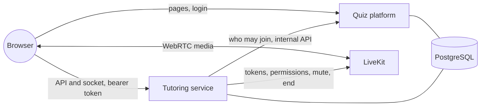

# Tutoring sessions

Code: `tutoring/` (a separate Go module and program, schema `tutoring`), `backend/internal/tutorlink` (the platform's side) and `frontend/src/lib/tutoring`, `frontend/src/routes/tutor`, `frontend/src/routes/t/tutoring`. Decisions: D-58 (LiveKit), D-59 (this design).

A tutoring session is a live online class in a desktop browser: the teacher broadcasts screens, cameras and voice to the class, students watch, chat and raise their hand, and speak or share only when the teacher allows it. It runs as its **own service** beside the quiz platform, so a busy or failing tutoring session can't slow down or stop a live quiz (ADR-18, PO-5).

## The pieces



| Piece | Does |
|---|---|
| Quiz platform | Logs people in and signs a **5-minute token** naming them (`POST /api/tutoring/token`). Answers the tutoring service's question "may this person take part in this classroom?" on `/internal/tutoring/access`, which isn't under `/api`, so the public proxy never forwards it. |
| Tutoring service | Sessions, the waiting room, permissions, hands, chat and attendance, in its own schema. Decides who may publish what and tells LiveKit. Never reads the platform's tables (TS-NFR-51). |
| LiveKit | Receives each track once and forwards it to everyone allowed to see it, in a few quality levels (simulcast). It never re-encodes. |
| Pages | `/t/tutoring` (the teacher's sessions) and `/tutor/CODE` (the room), in the platform's own frontend. `livekit-client` loads only on the room page. |

## Signing in

1. The page asks the platform for a token: HS256, issuer `quiz-platform`, audience `tutoring`, 5 minutes, naming the person's id, name and role.
2. Every call to the tutoring service carries it as `Authorization: Bearer …`. There are no tutoring cookies, so there is nothing to forge across sites.
3. The socket can't carry headers, so its first message is `{"token": "…"}`. The page sends a fresh token every 4 minutes; a socket whose token runs out is closed. Logging out of the platform therefore ends tutoring access within minutes (TS-NFR-52).
4. The tutoring service calls the platform with its own one-minute tokens (issuer `tutoring`, audience `quiz-platform`). Neither kind of token is accepted the other way round.

Both kinds are signed with **one shared secret file**: `QP_TUTORING_SECRET_FILE` on the platform, `TUTOR_SECRET_FILE` on the tutoring service. It is kept like the master key: a file, mode 0400, never an environment variable.

## A session

| Step | What happens |
|---|---|
| Create | A teacher creates a session for one of their classrooms (the platform confirms they teach it). It gets an 8-character join code and a link `/tutor/CODE`. |
| Join | A student opens the link while logged in, on a computer (phones and tablets see "Tutoring sessions need a computer"). The platform checks the classroom: enrolled students may join, and joining may enrol them as joining a quiz does (BR-02). There are no guests. |
| Wait | With "students wait until I admit them", students wait until the teacher admits them; otherwise they go straight in. Before the teacher starts, admitted students see "The session starts when the teacher starts it". |
| Start | The session goes live; attendance starts for everyone connected. |
| Teach | The teacher shares screens (several at once), cameras (several at once) and the microphone. Students see the teacher's tracks; screens fit whole, cameras fill their tile, and any track can go full screen. |
| End | Everyone is disconnected, the media room is deleted, and the session can't be joined again. |

One socket per person and session: a second tab replaces the first, which shows "You opened this session in another tab".

## What students may share

Nothing, by default (TS-FR-20). The teacher allows the microphone, camera and screen separately, per student or for everyone, from the People tab or the hand queue:

- **The server decides.** Each LiveKit token lists exactly the sources its holder may publish, and a change is sent to LiveKit at once (`UpdateParticipant`), which unpublishes a track whose permission was taken back. A modified browser can't publish more than it was allowed (TS-NFR-22).
- **Allowing isn't switching on** (PO-3). The student turns their own device on, after their own click and the browser's prompt. "Ask to turn on" shows the student a request they can accept or decline; nothing turns on by itself.
- **Raised hands** queue in order. "Allow mic" in the queue grants the microphone, asks the student and lowers the hand in one step.
- **Mute** mutes a student's published tracks of the chosen kind, or everyone's microphones at once.
- A student's own camera and screen go to the teachers only, not to other students (TS-FR-37). In this first version the student's browser sets that restriction when it joins, before it can publish anything.

## Chat

Plain text up to 1,000 characters, with links shown as links and never as HTML (TS-FR-43). The teacher chooses the mode, and can change it at any time:

| Mode | Students |
|---|---|
| Students to teacher only (default) | write questions only teachers see |
| Everyone | write to the whole room |
| Teacher announcements only | read only |
| Off | no chat |

Teachers can reply to one student privately, delete a message for everyone, mute one student in the chat, set slow mode (one message per N seconds per student) and pin a message. Late joiners get the history they may see. Chat goes through the tutoring service, not LiveKit, so it keeps working when the media server is down (TS-NFR-13). Deletions, removals, permission and chat-mute changes are written to the session's log (TS-NFR-42).

## Attendance

Attendance counts the time each person was connected while the session was live: first joined, last left, how many times they connected, and their total minutes. The teacher sees it in the Attendance tab and downloads it as CSV (formula-like names are escaped). A restart of the tutoring service closes the visits that were open; people reconnect and open new ones.

## Running it locally

Run the platform with tutoring on, the tutoring service, and LiveKit:

```sh
# in backend/: a shared secret and a LiveKit secret, once (.data is git-ignored)
openssl rand -hex 32 > .data/tutoring.secret
printf 'tutoring: %s\n' "$(openssl rand -hex 24)" > .data/livekit-keys.yaml

# LiveKit (from the pinned build the load test downloads, loadtest/.bin)
livekit-server --dev --bind 127.0.0.1   # or with a config naming key_file: .data/livekit-keys.yaml

# the platform
QP_TUTORING_URL=http://localhost:8090 QP_TUTORING_SECRET_FILE=.data/tutoring.secret … go run ./cmd/server

# the tutoring service
cd tutoring
TUTOR_DATABASE_URL=… TUTOR_SECRET_FILE=../backend/.data/tutoring.secret \
TUTOR_PLATFORM_URL=http://127.0.0.1:8080 TUTOR_PLATFORM_ORIGIN=http://localhost:8080 \
LIVEKIT_URL=http://127.0.0.1:7880 LIVEKIT_PUBLIC_URL=ws://127.0.0.1:7880 \
LIVEKIT_API_KEY=tutoring LIVEKIT_API_SECRET_FILE=../backend/.data/livekit-keys.yaml go run ./cmd/tutor
```

| Variable | Default | Meaning |
|---|---|---|
| `TUTOR_LISTEN` | `127.0.0.1:8090` | Where the service listens |
| `TUTOR_DATABASE_URL` | — | PostgreSQL; the service uses only its own `tutoring` schema |
| `TUTOR_SECRET_FILE` | — | The secret shared with the platform |
| `TUTOR_PLATFORM_URL` | — | The platform on the server's own network, for the internal API |
| `TUTOR_PLATFORM_ORIGIN` | — | Where the platform's pages come from: the only origin allowed to call the service (CORS, socket origin) |
| `LIVEKIT_URL` | `http://127.0.0.1:7880` | LiveKit's server API |
| `LIVEKIT_PUBLIC_URL` | — | What browsers connect to, e.g. `wss://tutor.example.edu` |
| `LIVEKIT_API_KEY`, `LIVEKIT_API_SECRET_FILE` | — | LiveKit's key and its secret file: just the secret, or LiveKit's own `key: secret` key file |
| `TUTOR_GENERATE_LIVEKIT_KEYS` | off | `1`: write the LiveKit key file on first start (containers) |

Windows sometimes reserves a range of ports around 7880 (`netsh interface ipv4 show excludedportrange protocol=tcp`); run LiveKit on other ports then.

## Tests

- `tutoring/internal/tutor`: the service against PostgreSQL, a fake platform and a fake LiveKit: creating and listing, joining, admitting, refusing, locking, removing, starting and ending; the sources in each LiveKit token; permission changes reaching LiveKit; hands, mute; every chat mode, private replies, deletion, pinning, slow mode; sockets (one per person, origins, the first message) and attendance.
- `backend/internal/tutorlink`: tokens, the internal API and every way a service token is refused.
- `loadtest/tutoring-media.mjs`: LiveKit's capacity on this machine (D-58). Run it with nothing else busy: the simulated viewers share the machine's cores.

## Not yet

Later phases add: handing the broadcast to a student, co-teachers, groups, recording, the bandwidth budget and admission control, scheduling and reminders, the whiteboard and polls inside a session, attendance reports for classrooms, and a TURN relay on port 443 for school firewalls.
